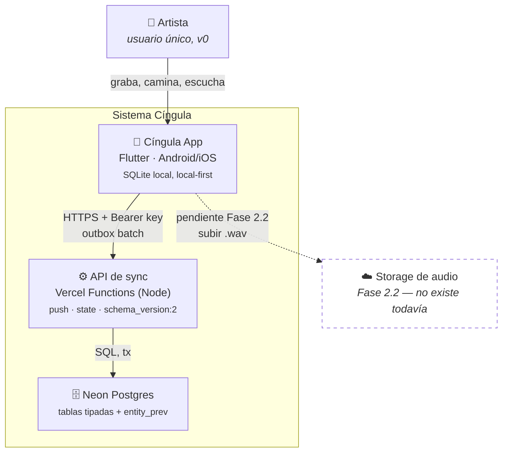
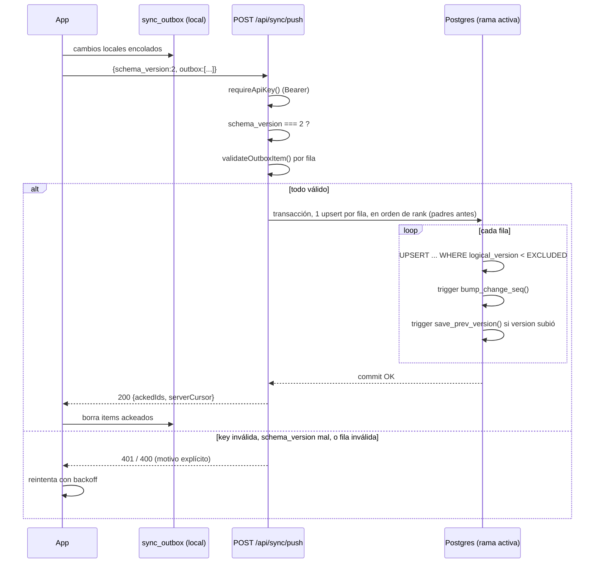
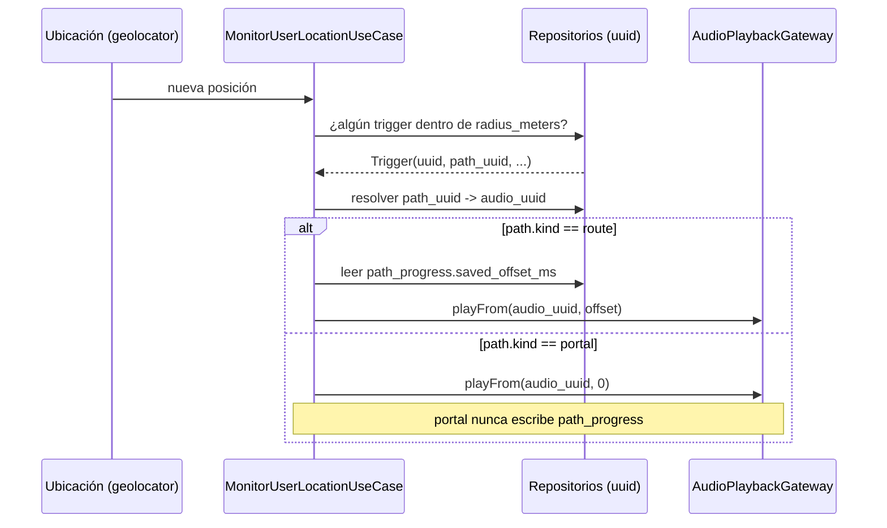

# Cíngula — Arquitectura del modelo de datos (v7)

Fuente canónica de estos diagramas. Si el schema cambia (`lib/data/migration/v7_schema.dart`,
`backend/schema.sql`) y estos diagramas no, están desactualizados — actualizarlos en el mismo
commit que el schema, no después.

Las decisiones (por qué, alternativas descartadas, riesgos) viven en `PROJECT.md` → Key
Decisions y en `phases/02.1-modelo-de-datos-objetivo/02.1-CONTEXT.md` (tags `D-XX`) — este
archivo es solo los diagramas.

Vista renderizada equivalente (bonus, no fuente): [Cíngula — Arquitectura v7](https://claude.ai/artifact/1pdP7cPxVK7kaoPVTtMYap).
Notion (narrativa + decisiones para lectura humana): "Cíngula App — Modelo de datos v7".

## 1. Arquitectura — Contexto y contenedores (C4)



## 2. Modelo de datos — DER

Un solo modelo lógico; se materializa distinto en el celular (SQLite) y en Neon (Postgres) —
ver tabla de diferencias más abajo.

```mermaid
erDiagram
    RECORRIDOS ||--o{ OBRAS : "recorrido_uuid (nullable, D-33)"
    OBRAS ||--o{ PATHS : "obra_uuid"
    OBRAS ||--o{ OBRA_ARTISTAS : "obra_uuid"
    ARTISTAS ||--o{ OBRA_ARTISTAS : "artista_uuid"
    PATHS ||--o{ TRIGGERS : "path_uuid"
    AUDIOS ||--o{ PATHS : "audio_uuid (nullable, D-11)"
    AUDIOS ||--o| AUDIO_LOCAL : "solo local, D-05"
    PATHS ||--o| PATH_PROGRESS : "solo local, D-10"

    RECORRIDOS {
        text uuid PK
        text name
        text description
    }
    OBRAS {
        text uuid PK
        text name
        text owner_id "sin FK: no hay tabla users aun"
        text recorrido_uuid FK "nullable, D-33"
        text visibility "draft or private or public"
        text share_token
        real cover_lat
        real cover_lon
    }
    ARTISTAS {
        text uuid PK
        text name
        text bio
        text user_id
    }
    OBRA_ARTISTAS {
        text uuid PK
        text obra_uuid FK
        text artista_uuid FK
    }
    AUDIOS {
        text uuid PK
        text kind "grabacion or final"
        text title
        text description
        int duration_seconds
        text storage_key "null hasta Fase 2.2"
        text checksum "null hasta Fase 2.2"
    }
    AUDIO_LOCAL {
        text audio_uuid PK_FK
        text local_path
        text remote_url
        text download_state
    }
    PATHS {
        text uuid PK
        text obra_uuid FK
        text kind "route or portal, CHECK"
        text name
        text audio_uuid FK "nullable"
        real tolerance_meters
    }
    PATH_PROGRESS {
        text path_uuid PK_FK
        int saved_offset_ms
    }
    TRIGGERS {
        text uuid PK
        text path_uuid FK
        int position
        text name
        real latitude
        real longitude
        real radius_meters
        int offset_ms
    }
```

Todas las entidades sincronizadas llevan además `updated_at`, `deleted_at`, `logical_version`
(omitidos arriba por espacio). `RECORRIDOS`, `ARTISTAS`, `OBRA_ARTISTAS` existen en el schema
(local y remoto, con sync completo) pero no tienen repositorio ni UI todavía — mismo estado que
`artistas` desde la Fase 2.1 original.

### Cómo se materializa cada lado

| Aspecto | Celular (SQLite) | Neon (Postgres) |
|---|---|---|
| Tipo de `uuid` | `TEXT` | `uuid` nativo |
| Timestamps | `INTEGER` (epoch, segundos) | `timestamptz` |
| Orden de cambios | no existe — un solo escritor | `change_seq bigint` por fila, secuencia global, la usa el cursor de pull |
| Historial de versión anterior | no existe | `entity_prev` — tabla aparte, PK `(table_name, record_uuid)`, guarda 1 versión previa vía trigger `save_prev_version()` |
| `audio_local` / `path_progress` | existen (solo local por diseño) | no existen — nunca viajan (D-05/D-10) |
| Cola de cambios salientes | `sync_outbox` | no aplica — Neon solo recibe |

## 3. Flujos — diagramas de secuencia

### 3.1 Migración local, primer arranque post-corte

```mermaid
sequenceDiagram
    actor U as Usuario
    participant App as main.dart
    participant DB as AppDatabase.init()
    participant Mig as migrateToV7()
    participant BK as backupBeforeMigration()

    U->>App: abre la app
    App->>DB: init()
    DB->>DB: lee PRAGMA user_version
    alt version == 6 (celular viejo)
        DB->>BK: copiar + verificar por conteo
        BK-->>DB: respaldo OK (*.pre-v7-fecha)
        DB->>Mig: migrateToV7(db)
        Mig->>Mig: crear tablas v7
        Mig->>Mig: copiar filas, id entero -> uuid
        Mig->>Mig: verificar diff exacto (EXCEPT) por tabla
        alt diff limpio
            Mig->>Mig: reconstruir outbox + renombrar legacy_*
            Mig-->>DB: user_version = 7
            DB-->>App: OK
            App-->>U: banner "Datos migrados; respaldo en ..."
        else discrepancia encontrada
            Mig-->>DB: throw MigrationException
            DB-->>App: excepción (D-25)
            App-->>U: pantalla bloqueante, datos intactos
        end
    else version == 7 (ya migrado)
        DB-->>App: nada que hacer
    end
```

### 3.2 Push de sincronización (celular → Neon)



### 3.3 Entrar a un geotrigger y reproducir



---

*Última actualización: 2026-09-22, corte de Fase 2.1 + D-33 (`recorridos`). Fuente: código real
(`lib/data/migration/v7_schema.dart`, `backend/schema.sql`, `backend/api/sync/push.js`,
`lib/domain/usecases/monitor_user_location_usecase.dart`), no una versión resumida de otro doc.*
