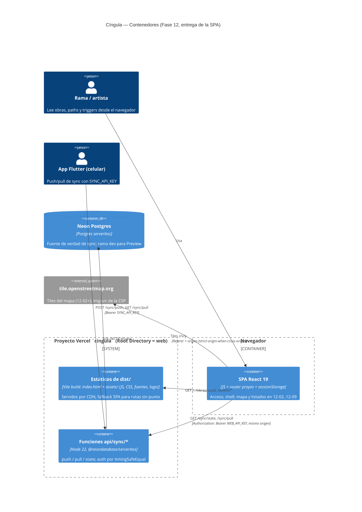

# Phase 12 Plan 01: Andamiaje SPA + Acceso (AUTH-02) y entrega en el mismo proyecto Vercel Summary

**SPA Vite + React 19 con router propio y pantalla de Acceso que valida la clave contra `GET /sync/state` (sessionStorage únicamente), servida desde el mismo proyecto Vercel que `web/api/` con `vercel.json` (rewrite `/sync` primero + fallback SPA con exclusiones + CSP) y validada en un Preview real: `SMOKE OK`.**

## Decisión de arquitectura (ADR) — va primero por regla de oro

### ADR: Entrega de la SPA en el mismo proyecto Vercel

| Campo | Contenido |
|-------|-----------|
| **Estado** | Aceptado, validado en Preview `https://cingula-ovrrh8ypt-ramas-projects-e2ba61a0.vercel.app` (`SMOKE OK`). Pendiente: gate con el celular y merge a `main` en 12-10 |
| **Contexto** | La Fase 12 agrega una web de lectura. `web/api/` (Fase 10/11) ya sirve `/sync/{push,pull,state}` al celular desde el proyecto Vercel `cingula` (Root Directory `web`). Hay que servir una SPA sin romper el push del celular en producción (INFRA-01). `vercel dev` crashea con `500 FUNCTION_INVOCATION_FAILED` en este equipo (H1), así que el ruteo no se puede probar localmente |
| **Decisión** | La SPA es un proyecto Vite dentro de `web/`, junto a `web/api/`, en el mismo proyecto Vercel. `web/vercel.json` declara `framework: "vite"`, `buildCommand: "npm run build"`, `outputDirectory: "dist"`, y `rewrites` en este orden: (1) `/sync/:path*` -> `/api/sync/:path*` (sin cambios respecto de Fase 11); (2) fallback SPA `/:path((?!api/\|sync/\|assets/)[^.]*)` -> `/index.html`. Más headers de seguridad en `/(.*)`: CSP (`default-src 'self'; script-src 'self'; style-src 'self' 'unsafe-inline'; img-src 'self' data: https://tile.openstreetmap.org; font-src 'self'; connect-src 'self'; object-src 'none'; base-uri 'self'; form-action 'self'; frame-ancestors 'none'`), `Referrer-Policy: strict-origin-when-cross-origin`, `X-Content-Type-Options: nosniff`, `Permissions-Policy`. Sin `functions`/`builds`/`routes` |
| **Por qué** | Vercel da precedencia al filesystem (estáticos de `dist/` y funciones de `api/`) antes de aplicar rewrites, y procesa los rewrites en orden: `/api/sync/*` y `/assets/*` nunca llegan al fallback y `/sync/*` entra por la regla 1. Un solo proyecto = mismo origen: `connect-src 'self'`, sin CORS, un solo deploy, una sola variable de entorno de clave |
| **Alternativas descartadas** | (a) Proyecto Vercel separado para la SPA: dos deploys, CORS, otra configuración de entorno. (b) Next.js (D-01 fijó Vite). (c) Fallback `/(.*)` sin exclusiones: queda como respaldo documentado si el Preview rechazara la regex (A1); no hizo falta. (d) `vercel dev` como gate de ruteo: roto en este equipo (H1) |
| **Consecuencias** | El ruteo del push del celular en producción depende del orden de `vercel.json`: cualquier cambio posterior a ese archivo exige correr el smoke extendido en un Preview antes de mergear. `web/.vercelignore` deja specs y e2e fuera del deploy. Todas las dependencias del SPA van como devDependencies para que el tracing de funciones sólo vea `@neondatabase/serverless` |
| **Riesgo mientras no se complete 12-10** | Mergear a `main` cambia el ruteo de producción del push del celular. Mitigado: Preview real validado (A1 y A2 confirmadas, abajo) y compuerta humana con el celular en 12-10. Si igual se colara HTML en `/sync/push`, el celular no pierde datos: `jsonDecode` lanza ante HTML (`lib/data/sync/sync_api_http.dart:41`) y el outbox reintenta. Deuda: `Production` no tiene `WEB_API_KEY` (sólo `SYNC_API_KEY`); la crea 12-03 antes del login real en producción. Pendiente de publicar en Notion al cerrar la fase (12-10), junto con la nota de ADR-005 que arrastra 11-05 |

**Asunciones validadas en el Preview real** (research):
- **A1** (la regex del fallback `(?!api/|sync/|assets/)[^.]*` es aceptada por Vercel): CONFIRMADA. No se usó el fallback `/(.*)`.
- **A2** (el preset `framework: "vite"` no altera el descubrimiento de funciones de `api/`): CONFIRMADA. `/api/sync/{state,pull}` -> 401 JSON y `/api/sync/push` por GET -> 405 JSON.

#### C4 — Contenedores



#### Secuencia — Acceso (AUTH-02)

El pull paginado que cierra el flujo lo implementa 12-02; acá se muestra el contrato que este plan deja armado.

```mermaid
sequenceDiagram
  autonumber
  actor U as Usuario
  participant SPA as SPA (Acceso.jsx)
  participant SS as sessionStorage (session.js)
  participant V as Vercel (rewrites + funciones)
  participant DB as Neon Postgres

  U->>SPA: abre / (sin clave)
  SPA->>SPA: guard App.jsx: getKey() null -> navigate('/acceso', replace)
  U->>SPA: tipea la clave y envía el form
  SPA->>SPA: trim; si vacía, no hay request
  SPA->>V: GET /sync/state (Authorization: Bearer clave, no-store)
  V->>V: rewrite /sync/:path* -> /api/sync/state (regla 1, antes del fallback)
  alt clave válida
    V->>DB: lee serverCursor / lastSyncAt
    V-->>SPA: 200 { serverCursor, lastSyncAt }
    SPA->>SS: setKey(clave) en cingula.key
    SPA->>SPA: navigate('/', replace) -> Shell
    Note over SPA,V: 12-02: pull paginado GET /sync/pull?cursor&limit con la clave de sessionStorage (cursor siempre string)
  else 401
    V-->>SPA: 401 { error: "invalid or missing API key" }
    SPA-->>U: bloque role=alert "Clave rechazada"
  else red caída o 5xx
    SPA-->>U: bloque role=alert "Sin conexión"
  end
  U->>SPA: "Salir de la web"
  SPA->>SS: clearKey()
  SPA->>SPA: navigate('/acceso')
```

## Performance

- **Duration:** ~45min
- **Tasks:** 3/3 (Task 1 resuelta por el usuario antes de la ejecución; Task 3 completada tras el checkpoint del Preview)
- **Files modified:** 23 (2 987 inserciones incluyendo `package-lock.json`)

## Accomplishments

- Acceso (AUTH-02) funcionando de punta a punta: guard de ruta, validación contra `/sync/state`, estados loading / 401 / red / `?motivo=401` / campo vacío, y `Salir de la web` sin confirmación.
- La clave vive sólo en `sessionStorage`; verificado por el e2e (storage y URL), por `grep` (`import.meta.env` ausente) y por el build con canario (`NO KEY IN BUNDLE`).
- Entrega SPA + funciones en un solo proyecto Vercel, con ruteo y headers verificados en un Preview real.
- Infraestructura de tests lista para el resto de la fase: Vitest acotado a `src/**/*.spec.{js,jsx}` (no pisa los `node:test` del backend) y Playwright con red mockeada.

## Verification evidence

- `cd web && npm run test:ui`: 2 archivos, 12 tests OK. `npm test` (backend, node:test): 48 pass / 0 fail / 5 skipped (sin `DATABASE_URL`, igual que antes). `npm run build`: genera `dist/index.html` y 3 `.woff2`. Playwright `acceso.spec.js`: 7 de 7 OK.
- `grep -c "@font-face" web/src/ds/tokens.css` = 3; `dependencies` = sólo `@neondatabase/serverless`; sin `import.meta.env` en `src/`.
- Build con canario en ambas variables de entorno de clave: `NO KEY IN BUNDLE`.
- `git diff 892aba0 HEAD -- web/api` vacío (backend intacto). `main` no se tocó.
- **Smoke contra el Preview real** (con el bypass en memoria; el secreto no se guardó ni se registra acá):
  `SMOKE OK https://cingula-ovrrh8ypt-ramas-projects-e2ba61a0.vercel.app`
  (chequeo 2, con clave, saltado: sin `SMOKE_API_KEY`; sólo se verificó ruteo.) Fallback de A1 usado: no.
- Sondas curl del orquestador sobre el Preview: `/`, `/acceso`, `/obras` = 200 `text/html`; `/sync/state` y `/api/sync/state` = 401 `application/json`; `/assets/nope.js` = 404 `text/plain`; headers presentes: CSP (`default-src 'self'`, `img-src` con `https://tile.openstreetmap.org`), `Referrer-Policy: strict-origin-when-cross-origin`, `X-Content-Type-Options: nosniff`, `Permissions-Policy`.
- **Human check en el Preview:** el usuario entró con la `WEB_API_KEY` de Preview y confirmó que la pantalla de Acceso se ve bien (fuentes, logo, layout).
  - **No verificado explícitamente en el Preview:** el mensaje "Clave rechazada" con clave mala y la ausencia de violaciones de CSP en la consola. Cubierto localmente por Playwright (clave mala -> alerta). La CSP no aplica en `vite dev`: queda para re-chequear con el detector de violaciones de CSP de 12-10.

## Task Commits

1. **Fuentes, licencia FFL y logo del DS** (por el orquestador, base del plan): `892aba0` (chore)
2. **Task 2: tracer Acceso + shell:** `028718d` (feat)
3. **Task 3: entrega en el mismo proyecto Vercel:** `b4df18a` (feat)

(Task 1, la compuerta humana de legitimidad de paquetes, no genera commit.)

## Deviations from Plan

### Auto-fixed Issues

**1. [Rule 3 - Blocking] Reset del branch de arranque del worktree**
- **Found during:** arranque
- **Issue:** el worktree se creó desde el merge del PR #1 (5b1ac2f), sin los archivos de planificación de la Fase 12.
- **Fix:** `git reset --hard ws/web` (paso sanctioned de arranque); el árbol de 5b1ac2f era idéntico al de 2f4f2c6, ancestro de `ws/web`, así que no se perdió contenido.

**2. [Rule 3 - Blocking] Navegador de Playwright faltante**
- **Found during:** Task 2 (verify)
- **Issue:** `browserType.launch: Executable doesn't exist` para `chromium_headless_shell-1243`.
- **Fix:** `npx playwright install chromium`, como anticipa el plan (A6). No es una instalación de paquete npm nueva (el paquete ya estaba aprobado).

**2b. [Rule 1 - Bug] La pantalla de Acceso no ocupaba el alto del viewport**
- **Found during:** Task 2 (captura de pantalla en Chromium)
- **Issue:** `.acceso` usaba `flex:1` pero `#root` no es flex, así que el degradé terminaba justo debajo de la tarjeta.
- **Fix:** `height:100vh` en `.acceso` (`web/src/app/shell.css`). Incluido en `028718d`.

**3. [Menor] `.gitignore` adelantado de Task 3 a Task 2**
- Las entradas `web/dist/`, `web/test-results/`, `web/playwright-report/` se commitearon con Task 2 (`028718d`) para que la salida del build y de Playwright no quedara sin trackear. El criterio de aceptación de Task 3 se cumple igual.

### Decisiones de interpretación

- El "motivo de bypass" nunca se escribió en archivos; el smoke se corrió en una sesión del orquestador con el secreto en memoria.
- El e2e agrupa "clave buena" y "sesión sobrevive al reload" en un solo test; el caso de campo vacío (sin request) es un test aparte. Total: 7 tests, cubren los 7 casos del paso 12.
- Chequeo 5 del smoke: se acepta si el status no es 200 y el content-type no es `text/html`.

## Issues Encountered

- `Production` no tiene `WEB_API_KEY` (hallazgo ya registrado en el plan): no bloquea este plan; 12-03 la crea antes del login real en producción.
- Verificación del smoke contra mock local (script-only) se hizo antes del Preview real; la evidencia de A1/A2 es la del Preview real, no la del mock.

## Auth gates

Ninguno durante la ejecución del código. Las dos intervenciones humanas fueron gates de plan, no fallas: Task 1 (legitimidad de paquetes) y el paso 5 de Task 3 (deploy y bypass del Preview).

## Known Stubs

Ninguno. `Shell` monta un `<main>` vacío por diseño: el home (mapa) lo agrega 12-02 y la nav 12-09, según el plan; no hay datos falsos ni placeholders de UI.

## Threat Flags

Ninguna superficie nueva fuera del `<threat_model>` del plan.

Estado de las amenazas del plan:
- T-12-01 (clave en bundle/URL/storage persistente): mitigada y verificada (canario, e2e, grep).
- T-12-02 (fallback SPA se traga `/sync/push`): mitigada y verificada en Preview real (401/405 JSON en `/sync` y `/api/sync`).
- T-12-03 (clickjacking): `frame-ancestors 'none'` presente en el Preview.
- T-12-04 (XSS/terceros): CSP `script-src 'self'` presente en el Preview; "sin violaciones de CSP en consola" no verificado a mano (ver arriba).
- T-12-05 (Referer a OSM): `strict-origin-when-cross-origin` presente.
- T-12-06 (SYNC_API_KEY pegada en el navegador): aceptada, sin cambios.
- T-12-07 (secreto de bypass): sólo en memoria de la sesión; no registrado.
- T-12-SC (npm installs): checkpoint `blocking-human` resuelto (7 `[SUS]` aprobados en las versiones fijadas), `--save-exact`, `package-lock.json` commiteado.

## Next Phase Readiness

12-02 puede montar el cliente de pull sobre `session.js`/`router.jsx` y la `SyncPill` en el `Shell`; 12-09 monta la nav. Ante un 401 en cualquier pull, la convención es `clearKey()` + `navigate('/acceso?motivo=401')` (el copy ya existe en Acceso). Cualquier cambio a `web/vercel.json` requiere correr de nuevo `smoke-preview.sh` en un Preview antes de mergear.

---
*Phase: 12-web-de-lectura*
*Completed: 2026-10-06*

## Self-Check: PASSED
