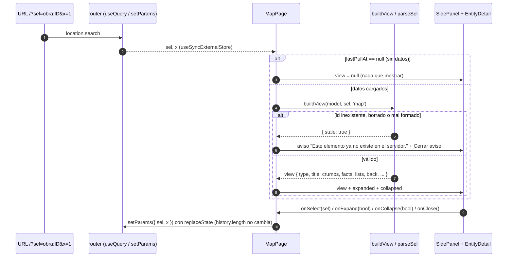

# Phase 12 Plan 05: Panel lateral único y vistas de los 5 tipos Summary

**Un solo `SidePanel` (compacto, expandido, riel, cerrado) muestra recorrido, obra, path, portal y trigger a partir de `buildView(model, sel, origin)`, se abre por deep link `/?sel=<tipo>:<uuid>` y nunca navega ni crea historial.**

## Decisiones que afectan el futuro (primero, por regla de oro)

| Decisión | Por qué | Alternativas descartadas | Riesgo mientras no se resuelva |
|----------|---------|--------------------------|--------------------------------|
| **`buildView` devuelve datos puros para los 5 tipos, incluidos `audio`, `strip`, `table`, `note` y `neighbors`, pero `EntityDetail` todavía NO los renderiza** (los pinta 12-06, según el plan) | El mismo objeto alimenta panel y página Obras (D-08); separar dato de render deja la lógica testeada sin DOM | Renderizar todo acá (pisa el alcance de 12-06 y arriesga conflicto de merge en `EntityDetail.jsx`) | **Hasta 12-06 el panel de un trigger no muestra la nota fija ni los vecinos, el de un path no muestra la tarjeta de audio, la tira ni la tabla, y la nota `La obra no tiene triggers, así que no hay dónde dibujarla.` de una obra sin cobertura no se ve** (sí se ve el hecho `Sin cobertura todavía`). La verificación de 12-06 debe cubrirlos |
| **`sel` se valida contra el modelo, no contra un regex de uuid** (T-12-21): tipo en la lista de 5, id con forma segura `[\w.-]{1,64}` y existencia en `model.byId`; el `kind` debe coincidir (`path` = route, `portal` = portal, `trigger` sólo de rutas) | El texto de la URL nunca llega a la vista; un `sel` hostil o viejo da el aviso, no una excepción ni HTML | Exigir forma de uuid v4 (rompe las fixtures y no agrega seguridad: si el id no está en el Map no hay nada que mostrar) | Si el servidor un día usa ids con otros caracteres, la regex los trataría como inexistentes; el síntoma sería "Este elemento ya no existe" ante un id válido |
| **Responsive < 900 px = hoja** (compacto 55 vh abajo, expandido pantalla completa bajo el header, plegado tira de 48 px) **es la ASUNCIÓN OI-05, sin validar con el usuario** | La UI-SPEC la marca [DEFAULT]; la web es de escritorio primero | No dar versión móvil (el panel de 380 px dejaría el mapa en ~0 px en un teléfono) | Puede no ser lo que el usuario quiere; el cambio es sólo CSS (`panel.css`, un bloque `@media`). Falta la comprobación humana a 800 px |
| **La pill, el popover y la lista de selección comparten Esc**: el panel no actúa si el foco está en `[role="dialog"], dialog[open]` | 12-04 monta el popover de sync; Esc no debe cerrar el panel a la vez | Listener global sin guardia | Depende de que 12-04 marque su popover con `role="dialog"` (o `<dialog>`); si usa otro marcador, Esc cerraría ambos. Verificarlo al integrar 12-04 |

#### Secuencia — deep link a una obra y expandir

## Performance

- **Duración:** ~75 min
- **Tareas:** 3/3 (Task 1 tracer, Tasks 2 y 3 auto/tdd)
- **Archivos:** 7 creados, 2 modificados bajo `web/`; `web/api/` sin diff; sin dependencias nuevas

## Accomplishments

- Tracer verificado de punta a punta antes de expandir: deep link -> `buildView(obra)` -> panel compacto -> `Ver detalle completo` agrega `x=1` sin cambiar `history.length`.
- Los 5 tipos con facts, listas, breadcrumb (origen `map` y `pageObras`) y `Volver a`; recorrido con créditos = artistas únicos de sus obras con enlace a cada uno (WEB-02); obra con visibilidad (valor fuera del CHECK en mono crudo), recorrido, artistas, cobertura en metros y paths/portales (WEB-04); path, portal y trigger anónimo (`Trigger 008`) (WEB-05).
- Chrome completo: riel de 48 px que conserva el flag expandido, cerrar, Esc (expandido -> compacto -> cerrado, con guardia de diálogos), región `aria-live`, selección inexistente, título de máximo 2 líneas, filas con elipsis y `title`, riel recortado a 420 px, listas de 4 filas + `+N más` (que expande).
- Panel antes del mapa en el DOM (orden de Tab: header, panel, mapa) y sin vista hasta que haya datos (un deep link no parpadea "ya no existe" mientras se lee el servidor).

## Verification evidence

- `cd web && npm run test:ui`: 9 archivos, 101 tests OK (49 del panel: `buildView.spec.js` 34, `SidePanel.spec.jsx` 15).
- `cd web && npx vitest run src/panel/buildView.spec.js -t recorrido` (12 pasan) y `-t path` (10 pasan), con el resto salteado por el filtro.
- `cd web && npx playwright test -c e2e/playwright.config.js`: 21 de 21 OK (7 de `panel.spec.js` nuevos, 6 de sync, 8 de acceso).
- `cd web && npm run build`: OK (JS 249,44 kB / 79,00 kB gzip).
- Aceptación por grep: `aria-live` en `SidePanel.jsx` = 1; `Detalle del elemento seleccionado` = 1; `max-width: 899px` en `panel.css` = 1.
- `git diff eddd682 HEAD -- web/api` vacío (sin cambios de backend).

## Task Commits

1. **Task 1: tracer, panel con la vista de obra:** `7646f4d` (feat)
2. **Task 2: estados del panel, teclado y selección inexistente:** `d2a4c0c` (feat)
3. **Task 3: vistas de recorrido, path, portal y trigger:** `3a8db11` (feat)

## Deviations from Plan

### Auto-fixed Issues

**1. [Rule 3 - Blocking] Reset del branch de arranque del worktree**
- **Found during:** arranque. HEAD era `5b1ac2f` (merge del PR #1), sin los archivos de la Fase 12.
- **Fix:** `git reset --hard ws/web` (paso sanctioned de arranque; `eddd682`), verificado `web/src/data/pull.js`, y `npm ci`.

**2. [Rule 1 - Bug] `buildView` de trigger no traía `lists`**
- **Found during:** Task 3, spec de camino de vuelta con `MapPage` real (`Cannot read properties of undefined (reading 'map')`).
- **Issue:** los tipos sin listas (trigger) devolvían la vista sin `lists` y `EntityDetail` lo recorría.
- **Fix:** valor por defecto `lists: []` en `BASE`; el spec lo cubre. Commit `3a8db11`.

**3. [Rule 1 - Bug] `neighbors.prev/next` valía `undefined` en los extremos**
- **Found during:** Task 3, spec de extremos. **Fix:** `null` explícito. Commit `3a8db11`.

**4. [Menor] Ledger de commits del plan**
- El protocolo 0c pide persistir `plan_head_before` en `.git/.../gsd-plan-head-before-12-05`; el entorno del worktree bloquea esa escritura (comando compuesto). Se usó el HEAD de arranque (`eddd682`, registrado arriba) y el conteo medido `git rev-list --count eddd682..HEAD` = 3 antes del commit de este SUMMARY.

### Decisiones de interpretación

- **Id del `sel`:** el plan dice "el uuid no tiene forma de uuid"; las fixtures usan ids legibles (`obra-A`, `path-A-portal`), que un regex de uuid rechazaría. Se valida la forma segura `[\w.-]{1,64}` y la existencia en el modelo (ver tabla de decisiones).
- **`typeLabel` en mayúscula** (`OBRA`, `PATH`...) tal como el contrato de copy; el anuncio de `aria-live` usa la forma capitalizada.
- **Triggers de portales no seleccionables:** `trigger:<uuid de un trigger de portal>` es stale; la vista de portal ya muestra su posición, radio y offset.
- **Breadcrumb con nombres reales** (`Recorrido Norte / Obra Aurora / Ruta A / Trigger 008`), no las etiquetas genéricas de la tabla de la UI-SPEC; el último segmento es el actual (`sel: null`, `aria-current="page"`).
- **`+N más`: el "path de 32 triggers" no produce una lista de 32 filas** (en la vista de path los triggers son un hecho, no una lista), así que el recorte de 4 filas se prueba con una vista sintética de 32 filas y con un recorrido de 6 obras; el path de 32 triggers se usa para la tira, el hueco y los vecinos.
- **`audio.emptyText`:** en `none` es `Este path|portal no tiene audio asignado.`; en `nofile` es el cuerpo `El audio está registrado, pero su archivo todavía no existe en el servidor.` (el título `Sin archivo todavía` es copy fijo que pone 12-06).
- **`requirements-completed: []` y no se marcaron WEB-02, WEB-04, WEB-05 ni WEB-08.** Este plan entrega la lógica de vista y el chrome del panel, pero el detalle de obra de la página Obras (WEB-04), la tarjeta de audio, tira y tabla (WEB-05) y la verificación de "ninguna vista" (WEB-08) cierran en 12-06, 12-09 y 12-10. Mismo criterio que 12-02; el orquestador puede marcarlos distinto.

## Issues Encountered

- La primera corrida de Playwright en frío tardó ~18 s (Vite optimizando dependencias) pero pasó; el ancho del panel transiciona 320 ms, así que el E2E espera con `expect.poll` en vez de medir al instante.
- Aviso para quien integre: `URLSearchParams` escribe `sel=obra%3Aobra-A` (el `:` se codifica). Funciona y se decodifica igual; sólo cambia el aspecto de la URL.

## Auth gates

Ninguno.

## Known Stubs

- `EntityDetail` no renderiza `audio`, `strip`, `table`, `note` ni `neighbors` por diseño del plan (los entrega 12-06); sus datos ya salen de `buildView` y están testeados. No hay datos falsos ni placeholders de UI.
- `onClose` en `MapPage` es el punto donde 12-08 devolverá el foco al marcador del mapa (comentado en el código). Hoy no hay marcadores (el mapa es de 12-07).

## Threat Flags

Ninguna superficie nueva fuera del `<threat_model>`.

- T-12-21 (`sel` de la URL): mitigada. `parseSel` valida tipo, forma de id, existencia y `kind`; spec con 12 entradas hostiles/viejas (`constructor:x`, `__proto__:x`, ``, id de 65 caracteres, obra borrada...) y spec de componente que verifica que el texto de la URL no aparece en el DOM.
- T-12-22 (XSS por nombres): mitigada. Ningún HTML crudo en `web/src/panel/` (`grep -rn "dangerouslySetInnerHTML\|innerHTML" web/src/panel` sólo aparece en un spec (aserción negativa)); spec con `` renderizado como texto y sin elemento `img`.
- T-12-SC (npm installs): sin instalaciones nuevas; `package.json` y lockfile sin cambios.

## Next Phase Readiness

12-06 consume de `buildView` los campos `audio` (3 estados), `strip` (`cells`, `ariaLabel`, `note`), `table` (`rows` con `n`, `name`, `sel`, `radius`, `offset`, `pos`), `note` y `neighbors` ({prev, next} o null), y los pinta dentro de `EntityDetail` (hay que decidir allí si la tabla reemplaza a la lista `Portales de la obra` en expandido: ambos vienen). 12-07 sólo tiene que llamar al handler de selección de `MapPage` (`select`, que además despliega el panel plegado) y re-encuadrar con `invalidateSize` al cambiar el ancho del panel (`.mapwrap` es `flex:1; min-width:0`). 12-09 usa `buildView(model, sel, 'pageObras')` y `EntityDetail expanded`. 12-04 debe marcar su popover con `role="dialog"` para que Esc no cierre también el panel. Falta la comprobación humana (a 800 px y con datos reales) que pide la Task 2.

---
*Phase: 12-web-de-lectura*
*Completed: 2026-10-06*

## Self-Check: PASSED
