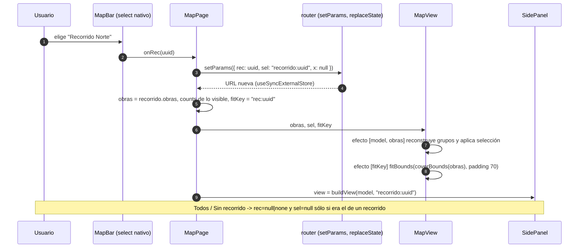

# Phase 12 Plan 07: Mapa general (Leaflet) con capas, filtro de recorrido y encuadre Summary

**El home es ahora un mapa Leaflet imperativo con cobertura, corredor por tramo con huecos ámbar, línea de path y portales, un selector que filtra y abre el panel del recorrido, casillas de capas y auto-encuadre por `fitKey`; todo accesible por teclado y sin HTML armado con datos del servidor.**

## Decisiones que afectan el futuro (primero, por regla de oro)

| Decisión | Por qué | Alternativas descartadas | Riesgo mientras no se resuelva |
|----------|---------|--------------------------|--------------------------------|
| **Los tiles dependen de `tile.openstreetmap.org` (un solo host, sin subdominios ni prefetch) y se oscurecen con un filtro CSS sobre `.leaflet-tile-pane`** (`invert(1) hue-rotate(180deg) brightness(.8) contrast(.9)`, [DEFAULT] OI-07) | Cero dependencia de un proveedor de tiles oscuros; un editor es uso liviano para la política de OSM; `vercel.json` ya limita `img-src` a ese host | Proveedor de tiles oscuros (cuenta, clave y costo, RNF-04); self-host de tiles (ops) | **Legibilidad real del mapa oscurecido sin validar** (los tests mockean los tiles con un PNG 1x1, así que ninguna prueba automática la ve) y OSM puede bloquear sin SLA. Pendiente la comprobación humana de OI-07 en el Preview con datos reales |
| **El re-encuadre lo gobierna una sola clave (`fitKey = rec:<valor>` desde que hay datos) y `fitTarget` (elegir desde un enlace del panel)**; abrir, expandir o plegar el panel y togglear capas nunca re-encuadran. El mapa sólo recalcula tamaño (`invalidateSize({ pan: true })`, centro conservado) | D-02 prohíbe re-encuadrar por capas, modo o panel; el panel cambia el ancho del contenedor y Leaflet sólo escucha `window.resize` | Re-encuadrar al cambiar `obras` (movería el mapa en cada pull de refresco) | Si 12-08 agrega el modo Círculos como cambio de `fitKey` rompería D-02: el modo NO debe tocar `fitKey`. Si `fitKey` se calcula con algo más que `rec`, un refresco movería el mapa |
| **`buildLayers` NO recibe `capas`**: construye los 6 grupos siempre y `syncGroups(map, groups, capas)` los agrega/quita del mapa (índice intacto) | Prender/apagar una casilla no debe reconstruir ni perder el foco de teclado (Pitfall 7); es la lectura de "los grupos apagados se quitan sin destruir el índice" | Reconstruir al cambiar `capas` (como pedía el listado de dependencias del plan en la interfaz) | Ninguno funcional; es una desviación de firma documentada abajo. 12-08 debe agregar el grupo `circles` a `CAPA_OF` (hoy sólo mapea los 6 grupos de este plan) |
| **Obras sin cobertura no dibujan NADA (ni sus paths ni portales)**, aunque tengan triggers; sólo cuentan en la leyenda | UI-SPEC "Obras sin cobertura: se omiten del mapa"; el auto-encuadre no las incluye, así que dibujarlas las dejaría fuera de vista | Dibujar sus triggers igual (aparecen sin cobertura ni encuadre) | El caso H4 (obra con triggers vivos pero `cover_*` NULL) queda invisible en el mapa; sólo se ve en el panel. Depende del dato real (medición de 12-03) |

#### Secuencia — elegir un recorrido en el selector

## Performance

- **Duración:** ~70 min
- **Tareas:** 3/3 (Task 1 tracer, Task 2 tdd, Task 3 auto)
- **Archivos:** 6 creados, 3 modificados bajo `web/`; `web/api/`, `package.json` y el lockfile sin diff (sin dependencias nuevas)

## Accomplishments

- Tracer verificado de punta a punta antes de expandir (Playwright con tiles mockeados): 2 rectángulos de cobertura (C sin cobertura y D borrada no), auto-encuadre dentro del contenedor con padding, clic abre el panel de la obra y expandir el panel no rompe el mapa.
- Capas completas: etiqueta de obra por `textContent`, corredor por tramo continuo con ancho = diámetro en metros recalculado en `zoomend` (`rescale`), línea de centros no interactiva + polilínea transparente de 16 px como área de clic, huecos ámbar `4 4`, portal = círculo en metros + punto + marcador divIcon de 44 px; estilos normal/related/selected/highlighted sin reconstruir.
- Teclado (R9, Pitfall 8): `tabindex=0 role=button aria-label` por `setAttribute` en el evento `add` (sobrevive a apagar/prender la capa) y Enter/Espacio explícito; foco visible (`stroke 3.5px` en SVG, `--glow-focus` en el portal).
- Filtro (D-04 + D-10): selector nativo con las 3 variantes, `rec` validado contra el modelo (T-12-28), leyenda con los conteos de lo visible, casillas de capas, velo `Leyendo el servidor…` / vacío / error con `Reintentar lectura`, controles deshabilitados sin datos.

## Verification evidence

- `cd web && npm run test:ui`: 12 archivos, 137 tests OK (15 nuevos en `layers.spec.js`; el spec de panel que monta `MapPage` real con `MapView` sigue verde).
- Playwright (todo el directorio `e2e/`, 35 de 35 OK): `mapa.spec.js` 13 tests (2 rectángulos, auto-encuadre, clic y expandir, capas/huecos/etiquetas, Enter en obra/path/portal, foco visible 3,5 px, recorrido -> panel con `Créditos` y `2 obras`, `Todos` cierra, `Sin recorrido` = `1 obra` y 0 rectángulos, `rec` desconocido ignorado, apagar Cobertura/Paths, vacío, primer pull fallido, mapbar a 1000 px) más los 22 de 12-01/12-02/12-04/12-05.
- `cd web && npm run build`: OK (JS 413,03 kB / 127,61 kB gzip; Leaflet entra al bundle).
- Aceptación por grep: `map.remove()` en `MapView.jsx` = 2 (comentario y llamada, >= 1), `ResizeObserver` = 1, `{s}` = 0, `preferCanvas` = 0, `innerHTML|dangerouslySet` en `src/map` y `src/pages` = 0, `Todos los recorridos` en `MapBar.jsx` = 1.
- `git diff 58e88c9 HEAD -- web/api web/package.json web/package-lock.json` vacío.

## Task Commits

1. **Task 1: tracer, Leaflet + cobertura + auto-encuadre:** `7cdd98d` (feat)
2. **Task 2: capas completas, selección, teclado:** `5269b09` (feat)
3. **Task 3: selector de recorrido, capas, leyenda, estados:** `a43d830` (feat)

## Deviations from Plan

### Auto-fixed Issues

**1. [Rule 3 - Blocking] Reset del branch de arranque del worktree**
- **Found during:** arranque. HEAD era `5b1ac2f`, sin los archivos de la Fase 12.
- **Fix:** `git reset --hard ws/web` (paso sanctioned de arranque; `58e88c9`), verificado `web/src/panel/buildView.js`, y `npm ci`.

**2. [Rule 3 - Blocking] jsdom no trae `ResizeObserver`**
- **Found during:** Task 1. `MapView` lo usa y `SidePanel.spec.jsx` monta `MapPage` real.
- **Fix:** stub de 1 línea en `src/test-setup.js` (`globalThis.ResizeObserver ??= class {...}`); el código de producción no lleva guardas para tests. Commit `7cdd98d`.

**3. [Rule 1 - Bug, prevenido] StrictMode dejaba el segundo mapa sin encuadrar**
- **Issue:** `lastFit` en un ref sobrevive al desmontaje de StrictMode; la segunda instancia veía el `fitKey` ya aplicado y no encuadraba.
- **Fix:** `lastFit` y `pendingFit` se reinician en el efecto de creación del mapa.

### Decisiones de interpretación

- **Firma de `buildLayers`:** el plan lista `{ obras, capas, onSelect }`. Se implementó `{ obras, onSelect, zoom }` y devuelve además `rescale`; `capas` lo aplica `syncGroups` fuera (ver tabla de decisiones).
- **Segunda copia de la verificación E2E:** el config estándar (`e2e/playwright.config.js`, puerto 5173 con `reuseExistingServer`) NO se usó: corre otro ejecutor (12-06) en paralelo y habría compartido o matado el servidor del otro worktree. Se corrió el mismo conjunto de specs con un config temporal fuera del repo (scratchpad) idéntico salvo `--port 5207` y `timeout` de 60 s. El orquestador puede re-correr `npx playwright test -c e2e/playwright.config.js e2e/mapa.spec.js e2e/panel.spec.js` tras el merge.
- **Clic sobre la obra A en el E2E:** en las fixtures A y B tienen el mismo bbox (B encima), así que un clic real por coordenadas cae en B. El test despacha el evento sobre el nodo de A (`dispatchEvent('click')`); el camino por teclado (Enter) sí se prueba sobre el nodo real.
- **Portal = 3 capas** (círculo en metros no interactivo, punto central como `L.circleMarker` de 3,5 / 5 px, marcador divIcon de 44 px): el punto central de la UI-SPEC necesita estilo por estado y el `circleMarker` lo da sin clases CSS; el spec cuenta el círculo con `instanceof L.Circle`.
- **Path con 1 trigger:** se dibuja un `L.circle` interactivo en el grupo `lines` (clic/teclado a `path:<uuid>`), no en el de corredor.
- **Tramo de 1 trigger entre dos huecos:** se duplica el punto para que el cap redondo dibuje un punto (una polilínea de un solo punto no renderiza).
- **Leyenda `Todos` = `model.counts`-like sobre las obras visibles:** cuenta obras sin cobertura (C) como pide el plan (`3 obras` con las fixtures).
- **`requirements-completed: []`:** WEB-01 incluye "triggers (círculos `radius_meters`)", que entrega el modo Círculos de 12-08; WEB-02 (créditos del recorrido) ya salió de 12-05 pero su entrada por el filtro es de este plan. El orquestador decide el marcado tras 12-08 y la verificación humana.

## Issues Encountered

- La primera corrida de Playwright en frío tardó más (Vite optimizando dependencias): se corrió una vez para calentar y luego los tests pasaron en 1-4 s cada uno.
- El `.obra-label` mide 0x0 (el texto va en un `span` desplazado con `translate(-50%, -50%)`), así que Playwright lo da por oculto: los tests apuntan al `span`.

## Auth gates

Ninguno.

## Known Stubs

Ninguno. `onClose` en `MapPage` sigue siendo el punto donde 12-08 devolverá el foco al marcador del mapa que abrió el panel (comentado); hoy el foco no se restituye. `MapBar` deja el lugar del segmentado `Corredor`/`Círculos` para 12-08 (comentado en el código).

## Threat Flags

Ninguna superficie nueva fuera del `<threat_model>`.

- T-12-25 (XSS por nombres): mitigada. Etiquetas de obra con `textContent`, `aria-label` por `setAttribute`, ningún `innerHTML` en `src/map` ni `src/pages`; spec con `` como nombre de una obra con cobertura (se ve como texto, sin elemento `img`, un solo hijo `span`).
- T-12-26 (política de tiles OSM): mitigada. Un solo host oficial, sin `{s}`, sin prefetch, atribución visible abajo a la derecha con enlace; los E2E mockean `https://tile.openstreetmap.org/**` con un PNG 1x1 (nunca salen a OSM).
- T-12-27 (Referer a OSM): aceptada. `Referrer-Policy: strict-origin-when-cross-origin` y `img-src` limitado al host ya estaban en `vercel.json`.
- T-12-28 (`rec` arbitrario): mitigada. Se compara contra el Map de recorridos del modelo; desconocido = `Todos` (spec E2E con `?rec=no-existe`).
- T-12-SC (npm installs): sin instalaciones; `package.json` y lockfile sin cambios.

## Next Phase Readiness

12-08 (modo Círculos y teclado entre triggers) sobre esta base: agregar el grupo `circles` (pane `circles` ya creada, z 450) a `buildLayers` y a `CAPA_OF` en `layers.js`, el segmentado en `MapBar`, y recibir `modo` en `MapView`; el modo NO debe cambiar `fitKey`. `applySelection` ya resalta el path del trigger elegido (`trigger:<uuid>`). Devolver el foco al marcador en `MapPage.close`. Para el roving tabindex de triggers, `makeInteractive` (interno de `layers.js`) fija `tabindex=0`; habrá que parametrizarlo. 12-09 reutiliza `MapView` para el mini-mapa (agregar la prop `mini` y apagar el control de zoom/atribución según la UI-SPEC). Falta la comprobación humana del `<human-check>` de la Task 3 en el Preview con datos reales: encuadre de todas las obras, legibilidad de los tiles oscurecidos (OI-07), recorrido -> panel con créditos y atribución OSM sin tapar por el zoom.

---
*Phase: 12-web-de-lectura*
*Completed: 2026-10-06*

## Self-Check: PASSED

- Archivos creados verificados: `web/src/map/MapView.jsx`, `layers.js`, `layers.spec.js`, `MapBar.jsx`, `map.css`, `web/e2e/mapa.spec.js`.
- Commits verificados en `git log`: `7cdd98d`, `5269b09`, `a43d830`; `git rev-list --count 58e88c9..HEAD` = 3 antes de este SUMMARY.
