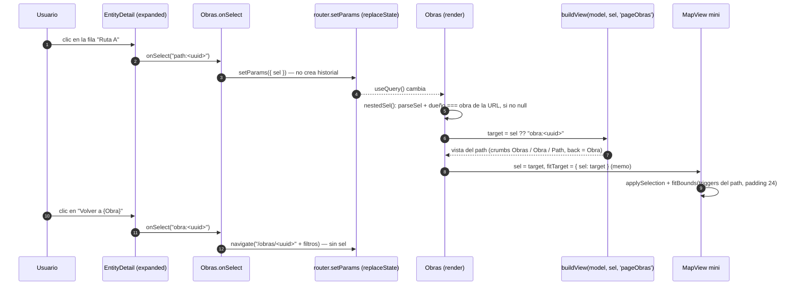

# Phase 12 Plan 09: Páginas Obras y Artistas, nav y mini-mapa Summary

**La web tiene ahora la arquitectura de información completa de la fase: nav Mapa / Obras / Artistas, `/obras` con filtros por recorrido y visibilidad que muestra el MISMO detalle expandido del panel del mapa (con mini-mapa de 240 px no interactivo y navegación anidada a path / portal / trigger), y `/artistas` con las obras de cada artista; ambas con estados de cargando, vacío, error y uuid inexistente.**

## Decisiones que afectan el futuro (primero, por regla de oro)

| Decisión | Por qué | Alternativas descartadas | Riesgo mientras no se resuelva |
|----------|---------|--------------------------|--------------------------------|
| **El detalle de Obras no tiene contenido propio: es `buildView(model, sel, 'pageObras')` renderizado por `EntityDetail expanded`** (el mismo objeto de vista que el panel, D-08). Lo único de página es el breadcrumb (`Crumbs`, exportado de `SidePanel.jsx`) y el mini-mapa | Un solo contrato de contenido para los 5 tipos: un cambio en `buildView` aparece en el mapa y en Obras a la vez; el origen `pageObras` sólo cambia la cadena de breadcrumb (12-05) | Un detalle de página escrito aparte (dos fuentes de verdad que derivan, el prototipo ya tenía un `v` separado por pantalla) | Cualquier cambio de `EntityDetail` que asuma el chrome del panel (p. ej. el botón `Ver detalle completo`, que sólo existe en compacto) afecta también a la página; hoy no aplica porque la página siempre es expandida |
| **Los recorridos no tienen página (D-10): un link `recorrido:` dentro del detalle de una obra navega al MAPA con `?rec=&sel=recorrido:`** (`Obras.jsx`, `onSelect`) | El detalle de la obra trae un fact `Recorrido` enlazable; sin un destino definido abriría una vista de recorrido huérfana dentro de Obras, con breadcrumb de un solo segmento y sin camino de vuelta | Mostrar la vista de recorrido dentro de Obras (contradice D-10); dejar el link inerte (rompe la expectativa de un enlace) | **Es una interpretación mía, no está en el UI-SPEC ni en el plan.** Si el usuario prefiere otro destino hay que cambiar una línea; hasta entonces el clic en el recorrido saca al usuario de la página Obras (push de historial, el botón Atrás vuelve) |
| **`?sel=` en `/obras/:uuid` se valida contra la obra de la URL** (`nestedSel`): sólo `path` / `portal` / `trigger` cuya obra dueña es la actual; todo lo demás (otra obra, inexistente, tipo `recorrido` / `obra`, malformado) se ignora **sin aviso** y se muestra el detalle de la obra | T-12-32: la URL decide qué se busca en el modelo, nunca qué se renderiza; un path de otra obra bajo `/obras/A` rompería el breadcrumb (`Obras / B / path`) y el mini-mapa | Aceptar cualquier `sel` válido (breadcrumb incoherente con la URL); mostrar el aviso `Este elemento ya no existe` como en el mapa (el plan no lo pide para la página) | Un deep link a un path que se borró del servidor cae silenciosamente al detalle de la obra, sin explicación (en el mapa sí hay aviso). Bajo impacto: la obra existe y el usuario ve su lista de paths |
| **El mini-mapa es `MapView` con `mini` (y `buildLayers` con `mini`), no un componente aparte; se omite en obras sin cobertura** | Reusa capas, encuadre, resaltado y limpieza `map.remove()` / `ResizeObserver` de 12-07; `mini` apaga interacción en Leaflet (`dragging`, `scrollWheelZoom`, `doubleClickZoom`, `boxZoom`, `keyboard`, `touchZoom`), no crea el control de zoom y no cablea handlers ni áreas de clic / marcadores `keyboard:true` (que Leaflet vuelve focuseables) | Un `<svg>` propio como el prototipo (duplica geometría y proyección, ya resueltas por Leaflet); `pointer-events: none` por CSS (no quita el `tabindex` de los marcadores) | Una obra sin cobertura no muestra mini-mapa (su detalle ya dice `Sin cobertura todavía`); una obra con un solo path de un trigger muestra el círculo no interactivo. Los tiles de OSM se piden por cada obra abierta (política de uso de OSM: mismo host, sin prefetch; el volumen es el de un editor único) |
| **Responsive < 900 px: el detalle REEMPLAZA al listado (CSS por clase `has-sel`) y `Volver al listado` es un `A` a `/obras{qs}`** | Es la regla DEFAULT de OI-05 del UI-SPEC; el estado vive en la URL, no en JS, así que el botón Atrás del navegador también funciona | Estado local de "vista de detalle" (se pierde al recargar) | **OI-05 sigue sin validar con el usuario**; se probó sólo a 800 px en Chromium (E2E). Sin uuid en la URL a < 900 px el detalle (la primera obra por defecto) queda oculto hasta que se elige una fila |

#### Secuencia — abrir un path desde el detalle de una obra

## Performance

- **Duración:** ~70 min
- **Tareas:** 3/3 (Task 1 tracer, Task 2 tdd, Task 3 auto)
- **Archivos:** 7 creados, 8 modificados bajo `web/`; `web/api/`, `package.json` y el lockfile sin diff (sin dependencias nuevas)

## Accomplishments

- **Tracer verificado de punta a punta antes de seguir** (Playwright, tiles mockeados): clic en `Obras` de la nav -> `/obras` con `aria-current=page` y subrayado de 2 px; `Borrador` deja sólo la obra B y escribe `?vis=draft`; abrir la obra A conserva los filtros en la URL y muestra `Obras /` en el breadcrumb; el deep link `/obras/<uuid A>` carga directo.
- Artistas (WEB-03): listado con `{n} obra(s)` (el `obra_artistas` borrado y la obra D no cuentan), detalle `ARTISTA` / `.dtitle` 40/300 / sub fijo / Nombre, Obras, Bio (omitida si vacía) / `APARECE EN` con filas que enlazan a `/obras/<uuid>`; el usuario del artista no existe en el modelo y la página no tiene fila para él (T-12-31, verificado con spec y E2E: `user-secreto` no aparece en el DOM).
- Estados de página (E4 / E5) cubiertos en jsdom y Playwright: 3 filas esqueleto sin animación, vacío con el copy de cada página, error de primera lectura con `.perr role=alert` + código HTTP + `Reintentar lectura` (que vuelve a pedir), uuid inexistente con mensaje fijo y `Volver al listado` (el texto de la URL nunca se renderiza).
- Mini-mapa: `role=img` `Mapa de {obra}`, 240 px, atribución de OSM como `<a>` hermano (un `role=img` hace presentacionales a sus hijos, por eso el link no vive dentro), sin control de zoom, y verificado que ni rueda, ni arrastre, ni 60 pulsaciones de Tab lo mueven o lo enfocan.

## Verification evidence

- `cd web && npm run test:ui`: 184 tests OK (16 archivos; `Obras.spec.jsx` 15, `Artistas.spec.jsx` 8, `layers.spec.js` +1 del modo mini).
- `cd web && npx playwright test -c e2e/playwright.config.js` (suite completa): 56 de 56 OK (`obras.spec.js` 12; `mapa.spec.js` y `teclado.spec.js` siguen verdes: el modo `mini` no cambió el mapa principal).
- `cd web && npm run build`: OK (JS 427,38 kB / 131,28 kB gzip; CSS 40,97 kB).
- Criterios de aceptación: `grep -c aria-current web/src/app/Shell.jsx` = 1; `grep -c 'aria-label="Secciones"'` = 1; `! grep -qE "/(recorridos|audios)" web/src/app/router.jsx web/src/app/App.jsx` sale con 0 (no hay rutas de Recorridos ni Audios).
- `git diff 3105edd HEAD -- web/api web/package.json web/package-lock.json` vacío. `innerHTML|dangerouslySet` no aparece en `src/pages`, `src/map` ni `src/panel` (la única mención está en un `expect` de `SidePanel.spec.jsx`). Sin archivos borrados en los commits.

## Task Commits

1. **Task 1: tracer, nav + /obras con filtros y detalle compartido:** `71808b0` (feat)
2. **Task 2: Artistas + estados de página compartidos + responsive < 900 px:** `b40f6b6` (feat)
3. **Task 3: mini-mapa y selección anidada con camino de vuelta:** `63e3a2e` (feat)

## Deviations from Plan

### Auto-fixed Issues

**1. [Rule 3 - Blocking] Reset del branch de arranque del worktree**
- **Found during:** arranque. HEAD era `5b1ac2f` (merge del PR #1), sin los archivos de la Fase 12.
- **Fix:** `git reset --hard ws/web` (paso sanctioned de arranque; `3105edd`), verificado `web/src/map/MapView.jsx` y `12-08-SUMMARY.md`, y `npm ci`.

**2. [Rule 1 - Bug] Alto de la fila `.ent` mayor a 64 px**
- **Found during:** Task 2 (E2E `nombre de 60 caracteres`). Con padding de 12 px y el `line-height` heredado la fila medía 83 px, no los 64 px del contrato.
- **Fix:** padding vertical 8 px, `line-height: 1.25` en título y sub, sin `margin-top` en el sub (`pages.css`); el E2E exige 64 px.
- **Commit:** `b40f6b6`

### Decisiones de interpretación

- **Archivo extra `web/src/pages/parts.jsx`** (no estaba en `files_modified`): `Vis`, `ListGate`, `NotFound`, `BackToList` los usan Obras y Artistas; duplicarlos sería el único otro camino.
- **Cambios mínimos fuera de los archivos listados:** `Crumbs` (`SidePanel.jsx`) y `visOf` (`buildView.js`) pasan a `export` (una palabra cada uno); `layers.js` y `layers.spec.js` reciben la opción `mini` (el plan sólo nombraba `MapView.jsx`, pero los handlers y los marcadores `keyboard: true` se crean dentro de `buildLayers`, no en `MapView`).
- **Link de recorrido -> mapa:** ver la segunda fila de la tabla de decisiones; no está en el plan.
- **`role="list"` en un `
` interno y no en `.listpane`:** el `.listpane` también aloja el esqueleto, el `.perr` y el texto de vacío, que no son `listitem`.
- **Conteo `{n} obra(s)` / `{n} artistas` oculto mientras no hay datos** (evita un `0 obras` falso durante la carga); con datos y 0 resultados sí se muestra `0 obras`.
- **Filtros en la URL con valores validados:** `?rec=` acepta `none` o un uuid existente en el modelo, `?vis=` uno de `public|private|draft`; un valor desconocido equivale a `Todos` (espejo de lo que hace `MapPage` con `rec`). Elegir una obra reconstruye la query con esos valores ya validados (no copia la query cruda).
- **Item `Obras` del breadcrumb** viene de `buildView` como `href: '/obras'` (12-05) y por lo tanto descarta los filtros activos; la fila del listado y `Volver al listado` sí los conservan.
- **Nav activa por prefijo de ruta:** `/obras/:uuid` marca `Obras`, `/artistas/:uuid` marca `Artistas`.

## Issues Encountered

- `getByText('ARTISTA')` de Playwright es una coincidencia por subcadena sin distinguir mayúsculas y chocaba con el sub `...artistas de sus obras`; los E2E usan `{ exact: true }`.
- La primera corrida de Playwright en frío se hizo con `--timeout=60000`; los tests individuales tardan 1-5 s.

## Auth gates

Ninguno.

## Known Stubs

Ninguno. (Datos reales: producción todavía no tiene recorridos, artistas ni `obra_artistas`, por 12-03: las pruebas usan fixtures sintéticas y los estados vacíos de Artistas y `Sin recorrido` están cubiertos por spec y E2E.)

## Human check pendiente (Task 3 `<human-check>`)

En el Preview final con datos reales: Obras y Artistas con nombres reales largos se leen sin desbordes; el mini-mapa muestra la obra correcta; a 800 px el listado y el detalle se alternan con `Volver al listado`. También siguen pendientes OI-05 (responsive < 900 px sin validar con el usuario) y el chequeo humano de legibilidad de tiles de 12-07 (OI-07). La auditoría `ponytail` explícita de la fase queda para el plan dedicado (12-10); en este plan se aplicó como disciplina de código (reuso de `EntityDetail` / `buildView` / `MapView`, sin dependencias nuevas, un solo archivo auxiliar).

## Threat Flags

Ninguna superficie nueva fuera del `<threat_model>`.

- T-12-31 (usuario del artista): mitigada. No está en el modelo (lista blanca de 12-02) y la página no tiene fila para él; spec y E2E comprueban que `user-secreto` / `SENSITIVE` no aparecen.
- T-12-32 (uuid / sel / filtros arbitrarios): mitigada. uuid buscado en `model.byId` (inexistente = mensaje fijo, sin eco), `sel` por `parseSel` + pertenencia a la obra, filtros comparados contra valores conocidos; spec con `<b>zzz</b>` como uuid.
- T-12-33 (XSS por bio / nombres): mitigada. Todo se renderiza como texto de React; `aria-label` del mini-mapa por atributo; la fixture `HTML_NAME` no crea ningún `img`.
- T-12-SC (npm installs): sin instalaciones; `package.json` y lockfile sin cambios.

## Next Phase Readiness

12-10 puede reutilizar `e2e/obras.spec.js` como regresión de páginas. La auditoría ponytail del plan dedicado debería mirar `parts.jsx` (4 exports pequeños) y la opción `mini` de `buildLayers` (tres ramas `if (!mini)`).

---
*Phase: 12-web-de-lectura*
*Completed: 2026-10-07*

## Self-Check: PASSED

- Archivos verificados: `web/src/pages/Obras.jsx`, `Artistas.jsx`, `parts.jsx`, `pages.css`, `Obras.spec.jsx`, `Artistas.spec.jsx`, `web/e2e/obras.spec.js`, `web/src/map/MapView.jsx` (prop `mini`), `web/src/map/layers.js` (opción `mini`).
- Commits verificados en `git log`: `71808b0`, `b40f6b6`, `63e3a2e`; `git rev-list --count 3105edd..HEAD` = 3 antes de este SUMMARY.
