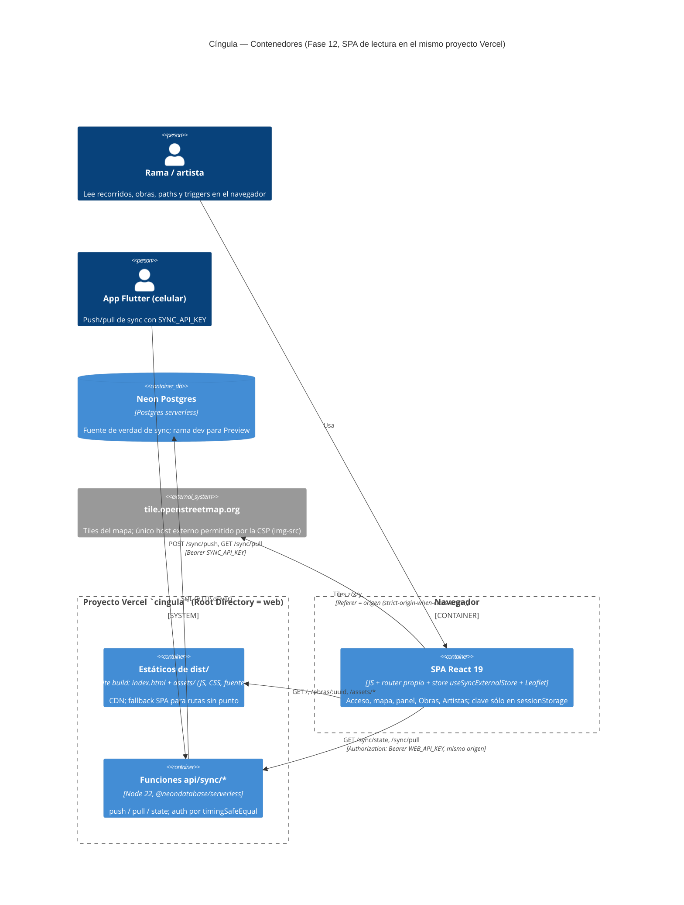
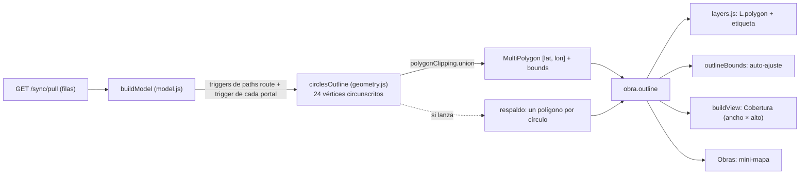

# PENDIENTE DE PUBLICAR EN NOTION — 2 ADRs ("Entrega de la SPA en el mismo proyecto Vercel" y "Cobertura de obra calculada en la web") + nota para ADR-005

> Estado de publicación: **NO publicado**. La sesión de 12-10 no tenía herramientas de Notion. El orquestador lo publica
> (skill `gestion-notion-rama`: Documentos de Proyecto, tipo "Desarrollo técnico", relacionado a Cíngula App) cuando el
> usuario confirme el cierre de la compuerta 12-10-03. Hasta entonces este archivo es la fuente. Texto derivado de
> `12-01-SUMMARY.md` (ADR original) + lo ocurrido en 12-02..12-10.

---

## ADR-0XX — Entrega de la SPA de lectura en el mismo proyecto Vercel que `web/api/`

### Decisión (va primero)

La SPA de lectura es un proyecto **Vite + React 19** dentro de `web/`, desplegado en el **mismo proyecto Vercel** (`cingula`, Root Directory `web`) que ya sirve `web/api/sync/{push,pull,state}` al celular. `web/vercel.json` es la única pieza de ruteo, con dos `rewrites` **en este orden**:

1. `/sync/:path*` -> `/api/sync/:path*` (idéntico a la Fase 11; es la ruta por la que el celular hace push).
2. Fallback SPA `/:path((?!api/|sync/|assets/)[^.]*)` -> `/index.html`.

Más headers de seguridad en `/(.*)`: CSP (`default-src 'self'; script-src 'self'; style-src 'self' 'unsafe-inline'; img-src 'self' data: https://tile.openstreetmap.org; font-src 'self'; connect-src 'self'; object-src 'none'; base-uri 'self'; form-action 'self'; frame-ancestors 'none'`), `Referrer-Policy: strict-origin-when-cross-origin`, `X-Content-Type-Options: nosniff`, `Permissions-Policy: geolocation=(), microphone=(), camera=()`. Sin `functions`/`builds`/`routes`. Todas las dependencias de la SPA son `devDependencies` (en `dependencies` sólo `@neondatabase/serverless`) para que el tracing de funciones de Vercel no las vea. `web/api/**` no se modificó en toda la Fase 12.

Lectura de datos: la SPA consume el contrato de pull de la Fase 10 (`GET /sync/state`, `GET /sync/pull?cursor&limit`, paginado, cursor **siempre string**) con `Authorization: Bearer WEB_API_KEY`; la clave vive sólo en `sessionStorage` de la pestaña (nunca en el bundle ni en la URL). Estado global de la SPA: un único store de módulo con `useSyncExternalStore` (sin librería de estado, router ni cliente HTTP).

### Estado

Aceptado. Validado en Preview real (`SMOKE OK`, 12-01) y con E2E local del recorrido completo (12-10). **Pendiente**: UAT en el Preview final, push real del celular antes y después del merge a `main`, smoke de producción y login real con la `WEB_API_KEY` de Production (compuerta 12-10-03). Actualizar este estado al cerrar la compuerta.

### Por qué

Vercel da precedencia al filesystem (estáticos de `dist/` y funciones de `api/`) antes de aplicar rewrites y procesa los rewrites en orden: `/api/sync/*` y `/assets/*` nunca llegan al fallback, y `/sync/*` entra por la regla 1. Un solo proyecto = mismo origen: `connect-src 'self'`, sin CORS, un solo deploy, una sola variable de clave de lectura.

### Alternativas descartadas

| Alternativa | Por qué no |
|-------------|------------|
| Proyecto Vercel separado para la SPA | Dos deploys, CORS, segunda configuración de entorno y de secretos |
| Next.js | D-01 fijó Vite; no hay SSR que justificarlo |
| Fallback `/(.*)` sin exclusiones | Respaldo documentado por si Vercel rechazaba la regex (A1); no hizo falta |
| `vercel dev` como gate de ruteo | Crashea con `500 FUNCTION_INVOCATION_FAILED` en el equipo del usuario (H1); el ruteo sólo se prueba en un Preview real (`web/scripts/smoke-preview.sh`) |

### Consecuencias y riesgos

- **El ruteo del push del celular en producción depende del orden de `web/vercel.json`.** Cualquier cambio futuro a ese archivo exige correr `smoke-preview.sh` (ruteo `/sync`, `/api/sync`, deep link, asset inexistente, headers) en un Preview **antes** de mergear.
- **Riesgo concreto hasta cerrar la compuerta 12-10-03:** mergear a `main` cambia el ruteo de producción. Mitigación: Preview validado, smoke extendido, E2E remoto con detector de CSP, push real del celular antes/después, Instant Rollback + `git revert -m 1`. Pérdida de datos acotada: si HTML se colara en `/sync/push`, `jsonDecode` lanza (`lib/data/sync/sync_api_http.dart:41`) y el outbox reintenta.
- **La CSP no existe en `vite dev`**: una regresión de CSP sólo se detecta contra un deploy real. Por eso `web/e2e/journey.spec.js` corre también en modo remoto (`E2E_BASE_URL`, `E2E_BYPASS`) con un listener de `securitypolicyviolation`.
- `web/.vercelignore` deja specs, `e2e/` y `src/test/` fuera del deploy (Vercel descubre cualquier `.js` de `api/` como función).
- Producción **no tiene datos de `recorridos`, `artistas` ni `obra_artistas`** (medido en 12-03): las pruebas usan fixtures sintéticas; los estados vacíos están cubiertos pero la UAT real de recorridos/artistas depende de que el celular los sincronice.
- Deuda: `Production` no tenía `WEB_API_KEY` (sólo `SYNC_API_KEY`); se crea en 12-03 y se usa en el login real de la compuerta.

### Diagrama C4 — Contenedores



### Diagrama de secuencia — Acceso y lectura (AUTH-02, WEB-07/08)

```mermaid
sequenceDiagram
  autonumber
  actor U as Usuario
  participant SPA as SPA (Acceso.jsx / store.js)
  participant SS as sessionStorage (session.js)
  participant V as Vercel (rewrites + funciones)
  participant DB as Neon Postgres

  U->>SPA: abre / (sin clave)
  SPA->>SPA: guard App.jsx: getKey() null -> navigate('/acceso', replace)
  U->>SPA: tipea la clave y envía el form
  SPA->>V: GET /sync/state (Authorization: Bearer clave, no-store)
  V->>V: rewrite /sync/:path* -> /api/sync/state (regla 1, antes del fallback)
  alt clave válida
    V->>DB: serverCursor / lastSyncAt
    V-->>SPA: 200
    SPA->>SS: setKey(clave)
    SPA->>V: GET /sync/pull?cursor=0&limit=1000 (repite hasta hasMore=false)
    V-->>SPA: { changes, nextCursor, hasMore }
    SPA->>SPA: applyRows (lista blanca de columnas) -> buildModel; sin filas con deleted_at
    SPA-->>U: mapa + pill "Sync al día"
  else 401
    V-->>SPA: 401
    SPA-->>U: "Clave rechazada" (en un 401 posterior: clearKey + /acceso?motivo=401)
  else red caída o 5xx
    SPA-->>U: "Sin conexión" / "Error de pull" (reintento 3 x 30 s)
  end
  U->>SPA: "Salir de la web"
  SPA->>SS: clearKey()
  SPA->>SPA: navigate('/acceso')
```

---

## ADR-0XX — Cobertura de obra calculada en la web como unión de los círculos de sus triggers

### Decisión (va primero)

El contorno de una obra en el mapa lo **calcula el cliente**: la unión exacta de los círculos (centro `latitude/longitude`, `radius_meters`) de los triggers de sus paths `route` y del trigger de cada portal, con `polygon-clipping@0.15.7` (una sola llamada, `union`, aislada en `web/src/data/geometry.js` → `circlesOutline`). Se calcula **una vez por pull** en `buildModel` (`obra.outline = { polygons, bounds }`, `polygons` en orden `[lat, lon]` de Leaflet) y alimenta el dibujo (`L.polygon`), el auto-ajuste (`outlineBounds`), el hecho "Cobertura" del panel (ancho × alto de los bounds, que ya incluyen el radio) y el mini-mapa de Obras. Cada círculo se discretiza como polígono **circunscrito** de 24 lados (error hacia afuera ≈ 0,9 % del radio). Si la unión lanza, **respaldo**: un polígono por círculo sin unir (costuras visibles; nunca pantalla en blanco; probado con un spy). Obra sin triggers: sin contorno.

**La web deja de leer las seis columnas `cover_*` de `obras`** (lista blanca `USED_COLUMNS.obras` = `uuid, name, recorrido_uuid, visibility`). **El servidor las conserva** (`web/schema.sql`, índice por bbox en `:127`) y `web/api/_lib/cover.js` sigue escribiéndolas: `web/api` no cambió en toda la Fase 12.



### Estado

Aceptado, pendiente de la compuerta humana 12-10-03 (aspecto del contorno de las 74 obras reales y costo de la unión con datos reales, ítem manual (h) de `12-VALIDATION.md`). Se publica en Notion junto al ADR anterior en el paso 11 de la compuerta. Actualizar este estado al cerrar la compuerta.

### Por qué

D-20 (usuario, UAT en el Preview): la línea blanca de la obra debe rodear toda la zona donde algún trigger se activa, siguiendo las curvas. La caja del servidor (a) excluía el radio de los triggers (H4) y (b) era NULL en 3 de 74 obras con triggers (medición de 12-03). El contorno sale de los mismos triggers que ya trae el pull: ninguna columna nueva y ningún cambio de `web/api` ni del contrato de pull de la Fase 10.

### Alternativas descartadas

| Alternativa | Por qué no |
|-------------|------------|
| Mantener el rectángulo `cover_*` del servidor | No incluye el radio (H4); NULL en 3 de 74 obras con triggers; no sigue las curvas pedidas en D-20 |
| Casco convexo de los triggers | Rellena concavidades y huecos de la obra que el usuario quiere ver |
| Truco SVG (trazo ancho + relleno) | No da un contorno real: no sirve para encuadre ni para la medida de "Cobertura" |
| Calcular el contorno en el servidor | Cambia `web/api` y el contrato del pull de la Fase 10; la escritura ya existente (`cover.js`) es de bbox, no de contorno |
| `polyclip-ts` en lugar de `polygon-clipping` | API-compatible y más reciente, pero la compuerta de paquetes (12-11 Task 1) aprobó `polygon-clipping`; queda como alternativa si éste se rompe |

### Consecuencias y riesgos

- **Dependencia nueva con mantenimiento bajo:** `polygon-clipping@0.15.7` (MIT, ~1,03 M descargas/semana, sin scripts de instalación) sin releases desde 2023-12-18, más las transitivas `robust-predicates@3.0.3` y `splaytree@3.2.3`. D-20 decía "sin dependencias": era falso. Va como `devDependency` exacta (13 en total; `dependencies` sigue siendo sólo `@neondatabase/serverless`) y con un único importador (`geometry.js`). Si deja de funcionar con una versión nueva de Node/Vite: cambiar a `polyclip-ts` (OI-12 de la UI-SPEC).
- **Costo en el bundle:** JS 427,38 → 455,99 kB (+28,6 kB), gzip 131,28 → 140,53 kB (+9,3 kB) (12-11-SUMMARY).
- **Trabajo muerto en el servidor:** `web/api/_lib/cover.js` sigue calculando y escribiendo `cover_*` en cada push aunque nadie las lea; quitarlo es un cambio de `web/api` fuera de la Fase 12.
- **Reconsiderar** si una fase de edición necesita el contorno en el servidor (p. ej. consultas espaciales o publicar el contorno a otro cliente): habría que mover el cálculo al servidor y versionar el contrato del pull.
- Costo de cómputo acotado por datos reales (máx 35 triggers por obra); la unión de 100 círculos encadenados corre bajo el timeout por defecto de Vitest (test de 12-11). Se calcula por pull, nunca por frame.

---

## Nota a agregar en ADR-005 (Monorepo: app, `backend/` y `web/` en este repo; aislamiento de prod por rama + preview + rama de Neon)

Pendiente acumulado desde la Fase 11 (11-02, 11-03, 11-04, 11-05) más lo que aporta la Fase 12:

1. **El riesgo que ADR-005 marcaba como "sin verificar" se confirmó** (11-02): antes de configurar Preview, `preview == production` en `DATABASE_URL`. Se corrigió con una variable scoped por rama y se verifica por host con `web/scripts/check-preview-db.sh` (nunca por valor completo).
2. **`vercel env pull --environment=preview --git-branch=<rama>` requiere que la rama exista en el remoto de Git conectado**; si no existe, Vercel cae silenciosamente al valor base del entorno. Aplica a toda variable scoped por rama, no sólo `DATABASE_URL`.
3. **`vercel env add` sin `--no-sensitive` crea la variable como Sensitive** y `vercel env pull` devuelve el placeholder `[SENSITIVE]`: `check-preview-db.sh` lo habría tomado por un host real distinto y reportado OK sin verificar nada. Toda variable que se deba verificar por host se agrega con `--no-sensitive`.
4. **Decisión de 11-03: `backend/` se disolvió en `web/`**, sin shims (reemplaza la estructura de monorepo que ADR-005 describía).
5. Registrar: el secreto de Protection Bypass (sólo en sesión, nunca en archivos), la `WEB_API_KEY` nueva (11-04; la de Production se crea en 12-03), el hallazgo de que **las variables de entorno necesitan un redeploy para aplicar**, y el bug de `sqflite` corregido en el camino (commit `2f4f2c6`, sin requisito `INFRA-*`).
6. **Fase 12:** el mismo proyecto Vercel ahora sirve también la SPA (ver ADR arriba); `web/vercel.json` pasa a ser parte del camino crítico del push del celular y por eso todo cambio a ese archivo se prueba en un Preview real con el smoke extendido antes de mergear.
