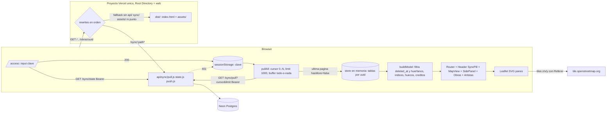

# Phase 12: Web de lectura - Research

**Researched:** 2026-10-05
**Domain:** SPA Vite + React 19 + Leaflet 1.9 imperativo, servida desde el mismo proyecto Vercel que la API de sync (`web/api/`), consumiendo `GET /sync/pull` / `GET /sync/state` con `WEB_API_KEY` en `sessionStorage`.
**Confidence:** HIGH en contrato de datos, ruteo Vercel y Leaflet (leído en código/docs esta sesión); MEDIUM en escala del modo Círculos (sin datos reales, ver OI-02) y en la regex de rewrite (no ejecutable localmente, ver Pitfall 1).

<user_constraints>
## User Constraints (from CONTEXT.md)

### Locked Decisions
- **D-01** Vite + React + Leaflet/OSM, SPA client-side rendered (confirmado sobre Next.js).
- **D-02** Vista inicial: zoom automático para encuadrar todas las obras existentes (no un centro fijo).
- **D-03** Cobertura, paths y triggers en capas activables (checkboxes), todas prendidas por defecto.
- **D-04** Filtro por recorrido: selector fijo arriba del mapa; filtra qué obras se muestran.
- **D-05** Tocar obra/path/trigger o seleccionar recorrido abre un panel lateral izquierdo (drawer) angosto; botón abrir/cerrar; botón expandir a pantalla completa (el mapa se achica proporcionalmente, nunca desaparece ni se navega). Expandido = detalle completo (WEB-04 para obra).
- **D-06** Un único componente de panel reusado para todos los tipos (D-18: 5 tipos).
- **D-07** Home tras loguearse = mapa general, sin dashboard intermedio.
- **D-08** Obras: página propia con URL (listado filtrable por recorrido y visibilidad + detalle), también accesible desde el panel del mapa.
- **D-09** Artistas: página propia con URL (listado + detalle con obras). No usa el panel del mapa.
- **D-10** Recorridos: SIN página propia; viven en el panel del mapa (filtro D-04 + panel con créditos calculados y lista de obras).
- **D-11** Audios: sin listado propio; metadata (título, descripción, `kind`) inline en el detalle del path/portal que lo usa. WEB-06 "queda satisfecho así".
- **D-12** Obra -> path mantiene camino de vuelta (breadcrumb / "Volver a la obra").
- **D-13** Estado de sync: indicador fijo en el header (último pull, cursor, errores explícitos).
- **D-14** Prototipo de Claude Design = referencia visual vigente (datos inventados).
- **D-15** Identidad = Cíngula Design System (oscuro, Chillax + Synonym, mint/azure/violeta/magenta/ámbar). Íconos `lucide-react`.
- **D-16** Triggers y portales son distintos. Trigger = círculo anónimo (ningún trigger tiene nombre, el nombre es del path, incluido el path `kind=portal`). Portal = `paths.kind='portal'` hijo directo de la obra (OI-01 cerrado 2026-10-05).
- **D-17** Paths en el mapa en dos modos: Corredor (default) y Círculos; Huecos en ámbar en ambos modos y contados en el detalle del path.
- **D-18** Panel de 5 tipos (recorrido, obra, path, portal, trigger); capas Cobertura/Paths/Portales; tira de cobertura por trigger; portales listados en el detalle de la obra; audio inline con estado "sin archivo todavía". `12-UI-SPEC.md` R1-R14 prevalece sobre el prototipo.

### Claude's Discretion
- Densidad de listados (Obras, Artistas); estados vacíos y errores de pull más allá de "estado honesto"; ancho y animación del panel; ajustes finos de color/tipografía sobre el DS.
- **Cómo estructurar el build de Vite dentro de `web/` sin colisionar con el descubrimiento de funciones de Vercel** (`outputDirectory`, orden de rewrites; la SPA no puede interceptar `/sync/*` ni `/api/*`). -> resuelto en "Architecture Patterns / Pattern 1".

### Deferred Ideas (OUT OF SCOPE)
- Escritura desde la web (ADR-006 etapas 1 y 2), edición de paths, parámetros de reproducción configurables, estadísticas de reproducción, reconsiderar Next.js, listado propio de Audios. STOR-04 real (reproducir) es Fase 13: acá solo el estado "Sin archivo todavía" + slot reservado.
</user_constraints>

<phase_requirements>
## Phase Requirements

| ID | Description | Research Support |
|----|-------------|------------------|
| AUTH-02 | Pantalla de acceso, clave una vez, ninguna clave en el bundle | Validar con `GET /sync/state` + Bearer; guardar en `sessionStorage`; 401 -> borrar y `/acceso?motivo=401` (Security Domain; Pattern 5) |
| WEB-01 | Mapa con cobertura, paths, triggers (círculos `radius_meters`), filtro por recorrido, navegar al detalle | Leaflet imperativo, panes propias, `L.circle` en metros (Pattern 3), geometría de corredor y huecos (Pattern 4) |
| WEB-02 | Recorridos con obras y créditos (unión de artistas) | `buildModel` (Pattern 2): índices `obrasByRecorrido`, `artistasByObra`; créditos calculados en el modelo |
| WEB-03 | Artistas con sus obras | Índice inverso `obrasByArtista` desde `obra_artistas` filtrado |
| WEB-04 | Obras filtrables por recorrido y visibilidad + detalle | Enums reales `draft/private/public`; cobertura = bbox de centros (ver Hallazgo H4) |
| WEB-05 | Detalle de path: kind, audio, grabación de origen, `tolerance_meters`, triggers ordenados por `position` | Columnas reales de `paths`/`triggers`; triggers anónimos (R4, enmienda 2026-10-05) |
| WEB-06 | Audios con metadata (inline por D-11) | `AudioCard` 3 estados; **REQUIREMENTS.md WEB-06 sigue con el texto viejo** (Hallazgo H7) |
| WEB-07 | Estado de sync: cursor, último pull, errores | Cliente de pull con estados explícitos (Pattern 2b); cursor siempre string |
| WEB-08 | Ninguna vista muestra filas con `deleted_at` | Filtro en el ingreso al store + filtro de huérfanos (Pitfall 5) |
</phase_requirements>

## Summary

La fase es un build de frontend greenfield dentro de `web/`. El backend que consume ya está cerrado y verificado: `GET /sync/pull` devuelve una lista plana ordenada por `change_seq` con las 7 tablas, cada fila una sola vez en su estado actual (la versión anterior no se expone), borradas incluidas como fila completa con `deleted_at` seteado. La clave `WEB_API_KEY` **y** `SYNC_API_KEY` leen (el backend no distingue en la respuesta), así que la web no puede forzar "clave de solo lectura" del lado servidor. Todo lo que la UI-SPEC describe es construible con ese contrato, con tres desvíos para confirmar (H4 cobertura = bbox de centros, H5 `position` puede tener huecos, H7 texto de WEB-06/WEB-02 en REQUIREMENTS).

Decisión de arquitectura de delivery (la que más futuro condiciona): **la SPA se agrega a `web/` como proyecto Vite en la misma carpeta que `web/api/`**; `web/vercel.json` pasa a declarar `framework: "vite"`, `buildCommand`, `outputDirectory: "dist"`, el rewrite `/sync/:path*` **primero** y un fallback SPA **después** que excluye `api/`, `sync/` y `assets/`; Vercel da precedencia al filesystem (estáticos y funciones) antes de aplicar rewrites, por lo que `/api/sync/*` nunca llega al fallback. `vercel dev` está roto en este equipo (Windows, `@vercel/node@16.0.1`, 11-03-SUMMARY): el flujo de desarrollo es `vite` con proxy de `/sync` hacia producción, y la verificación de ruteo es un **Preview real + `smoke-preview.sh` extendido**.

Stack de runtime mínimo (ponytail): `react`, `react-dom`, `leaflet`, `lucide-react`; sin router, sin librería de estado, sin cliente HTTP (fetch), sin react-leaflet, sin TypeScript (consistente con `web/api` JS ESM). Router a mano (~40 líneas con `useSyncExternalStore`), store en memoria con un modelo derivado puro (`buildModel`) testeable con Vitest sin DOM. Testing: Vitest (jsdom) para lógica y componentes, Playwright (Chromium ya presente en el equipo) para teclado/foco del mapa y el login con red mockeada.

**Primary recommendation:** Plan 1 = andamiaje Vite + `vercel.json` + assets del DS + infraestructura de tests + script de medición `measure-pull.mjs` (OI-02) + Preview de verificación de ruteo; después cliente de pull/`buildModel` puros con tests; después UI. No tocar `web/api/**`.

## Architectural Responsibility Map

| Capability | Primary Tier | Secondary Tier | Rationale |
|------------|-------------|----------------|-----------|
| Servir SPA estática y fallback de rutas | CDN / Static (Vercel) | — | `dist/` estático; el fallback es un rewrite de plataforma, no código |
| `/sync/*`, `/api/*` | API / Backend (Vercel Functions, ya existe) | — | Esta fase no los modifica (D-09/Phase 10) |
| Autenticación por clave | Browser / Client (`sessionStorage` + header Bearer) | API / Backend (valida con `timingSafeEqual`) | Una sola clave compartida (AUTH-01); el cliente solo la guarda y la envía |
| Pull paginado + merge a store | Browser / Client | API / Backend | Protocolo ADR-004: la web es un cliente de pull más; todo-o-nada en un buffer |
| Modelo derivado (índices, créditos, huecos, filtro `deleted_at`) | Browser / Client | — | El servidor no tiene endpoints de lectura de dominio; solo `pull` |
| Render de mapa (Leaflet), panel, listados | Browser / Client | — | SPA CSR (D-01) |
| Tiles de mapa | Externo (`tile.openstreetmap.org`) | Browser | Requiere Referer válido y atribución (política OSM) |
| Headers de seguridad (CSP, Referrer-Policy) | CDN / Static (`vercel.json` `headers`) | — | Config de plataforma |
| Reproducción de audio | — (Fase 13) | — | Solo slot y estado "Sin archivo todavía" |

## Hallazgos H1-H7 (decisiones/riesgos que el planner debe ver primero)

Estos hallazgos afectan el futuro de la fase y contradicen o precisan algo de `12-UI-SPEC.md`, `REQUIREMENTS.md` o el prototipo. Van antes que el detalle de implementación.

| # | Hallazgo | Fuente | Riesgo mientras no se resuelva | Acción propuesta |
|---|----------|--------|--------------------------------|------------------|
| H1 | **`vercel dev` no sirve para desarrollar la API en este equipo**: crashea con `500 FUNCTION_INVOCATION_FAILED` ante cualquier función. El ruteo real solo se valida contra un Preview. | `web/README.md` (sección Dev local: "`vercel dev` ... crashea al invocar CUALQUIER función local"); `11-03-SUMMARY.md` Deviations | **ALTO**: un `vercel.json` con rewrite mal ordenado rompe el push del celular en producción (INFRA-01) y no se detecta localmente | Dev = `vite` + proxy `/sync` a `https://cingula.vercel.app`; gate de merge = Preview + `smoke-preview.sh` extendido con chequeos de ruteo SPA (ver Pattern 1 y Wave 0) |
| H2 | **El pull NO distingue qué clave leyó**: `apiKeyRole` devuelve `'sync'` o `'web'` pero el handler solo hace `if (!apiKeyRole(request))`; ambas leen `pull` y `state`. Cualquiera de las dos claves tipeada en la web funciona. | `web/api/_lib/auth.js:7` `const KEYS = [['sync', 'SYNC_API_KEY'], ['web', 'WEB_API_KEY']];` y `web/api/sync/pull.js:38` `if (!apiKeyRole(request)) return response.status(401)` | Bajo: es consistente con R8 de la UI-SPEC (copy del 401 ya corregido). Pero la `SYNC_API_KEY` (que puede escribir) quedaría en `sessionStorage` si el usuario la pega | Copy del login: pedir "la clave de lectura" sin afirmar que la otra es rechazada; no se cambia backend |
| H3 | **El payload del pull trae columnas que la UI no debe mostrar ni loguear**: `obras.share_token`, `obras.owner_id`, `artistas.user_id`, `audios.checksum`/`storage_key`. | `web/api/_lib/spec.js:26-27` `uuid: 'uuid', name: 'text', owner_id: 'uuid', recorrido_uuid: 'uuid', visibility: 'text', share_token: 'text'` | Medio: `share_token` es un secreto de compartir; renderizarlo/volcarlo a consola lo expone | En el mapeo a modelo, **no copiar** `share_token`/`owner_id`/`user_id` a los objetos de vista (lista blanca de columnas por tabla); test lo verifica |
| H4 | **La cobertura (`cover_*`) es la caja de los CENTROS de los triggers, no incluye el radio**, la calcula el celular (no el servidor) sobre todos los triggers no borrados de todos los paths de la obra (rutas + portales), y se recalcula solo si cambió. Un rectángulo dibujado con esas columnas corta los círculos de los bordes; "{ancho} × {alto} m" subestima la extensión real en ~2 radios. | `lib/data/datasources/local/obra_local_data_source.dart:32-34,44` ("Recalcula la cobertura de la obra a partir de TODOS los triggers de sus paths" / `WHERE p.obra_uuid = ? AND t.deleted_at IS NULL`) y `lib/data/migration/cover.dart` ("Media aritmetica del centro + caja min/max") | Medio: visual levemente inconsistente con los círculos; riesgo de cobertura vieja si el celular no recalculó | Mantener R2 (rectángulo del bbox) pero `fitBounds` de obra/selección con margen = radio máximo de sus triggers; rotular la métrica "extensión entre centros" o aceptar la aproximación y documentarlo en copy. Plan 1 mide cuántas obras tienen cobertura NULL con triggers vivos |
| H5 | **`triggers.position` puede tener huecos o repetidos** (no hay UNIQUE ni constraint de contigüidad; las filas borradas dejan huecos). La UI-SPEC define "Trigger 007 = `position + 1`" y "Orden {pos} de {n}". | `web/schema.sql:95` `"position" integer NOT NULL DEFAULT 0` (sin UNIQUE en 92-106) | Medio: numeración y "Orden N de M" inconsistentes si hay borrados | Ordenar por `(position, uuid)` y numerar por **índice en la lista filtrada** (no `position + 1`); Plan 1 mide huecos/duplicados reales [ASSUMED que existan] |
| H6 | **Los insumos visuales del contrato viven en un directorio temporal** (`C:/Users/ramac/AppData/Local/Temp/claude/.../scratchpad/...`): prototipo `.dc.html`, y la copia del DS (`tokens.css`, `components/bundle.css`, `README.md`). Pueden desaparecer. Faltan los `.woff2` y `logo-mark-light.png`. | `12-UI-SPEC.md` línea 13 y R11; `ls` del directorio del DS esta sesión: 3 archivos | Medio: si se pierde, el ejecutor no puede reproducir el prototipo ni los tokens | Primera tarea: copiar `tokens.css` + `bundle.css` a `web/src/ds/` (commit) y obtener los 3 `.woff2` usados (ver sección Design System assets) |
| H7 | **`REQUIREMENTS.md` WEB-06 y WEB-02 no reflejan D-10/D-11.** WEB-06 dice "listado de audios ... y en qué paths se usa cada uno"; D-11 lo satisface "inline, sin listado propio". WEB-02 dice "listado y detalle de recorridos" y D-10 no da página propia. Solo WEB-05 fue enmendado (2026-10-05). | `.planning/workstreams/web/REQUIREMENTS.md:46` y `:42`; `12-CONTEXT.md` D-10/D-11 | Medio: el verificador de fase puede marcar WEB-06/WEB-02 como incumplidos aunque se implemente D-10/D-11 | Tarea de docs en Plan 1: enmendar WEB-06 ("metadata del audio inline en el detalle del path/portal que lo usa") y WEB-02 ("selector de recorridos + panel con obras y créditos") con la misma trazabilidad que WEB-05 |

## Standard Stack

### Core
| Library | Version | Purpose | Why Standard |
|---------|---------|---------|--------------|
| vite | 8.3.2 (publicado 2026-10-01) | Build/dev server SPA | D-01. Engines `^20.19.0 || >=22.12.0` (compatible con `engines >=22` de `web/package.json` y Node 24 local) [VERIFIED: npm registry] |
| @vitejs/plugin-react | 6.1.2 | JSX/Fast Refresh en Vite 8 | peer `vite ^8.0.0` [VERIFIED: npm registry] |
| react / react-dom | 19.3.0 | UI | UI-SPEC Registry Safety lo fija [VERIFIED: npm registry] |
| leaflet | 1.9.4 (publicado 2025-08-16, `latest`) | Mapa imperativo | D-01; `postinstall` null [VERIFIED: npm registry] |
| lucide-react | 1.52.0 | Íconos (DS declara Lucide, D-15) | UI-SPEC lo prescribe; UI-SPEC citaba 1.50.0 al 2026-10-03, hoy es 1.52.0 [VERIFIED: npm registry] |

### Supporting (solo devDependencies; no entran al bundle ni al tracing de funciones)
| Library | Version | Purpose | When to Use |
|---------|---------|---------|-------------|
| vitest | 5.0.3 | Test runner unit/component | Mismo toolchain que Vite; requiere Node `^22.12 || ^24 || >=26` [VERIFIED: npm registry] |
| jsdom | 30.1.2 | DOM de tests de componentes | Requiere Node `^22.22.2 || ^24.15.0 || >=26` (Node local 24.21.0 cumple) [VERIFIED: npm registry + `node --version`] |
| @testing-library/react | 16.3.3 | Tests de componentes | Estándar [VERIFIED: npm registry] |
| @testing-library/user-event | 14.6.7 | Teclado/clics en tests | [VERIFIED: npm registry] |
| @testing-library/jest-dom | 7.0.1 | Matchers de DOM/ARIA | [VERIFIED: npm registry] |
| @playwright/test | 1.63.0 | E2E de teclado/foco/login con red mockeada | Chromium ya instalado localmente (`ms-playwright/chromium-1208`, `chromium_headless_shell-1228`); coincidencia exacta con 1.63 [ASSUMED] -> `npx playwright install chromium` si falta |

### Alternatives Considered
| Instead of | Could Use | Tradeoff |
|------------|-----------|----------|
| Router a mano (~40 líneas) | `wouter` 3.13.0 / `react-router` 8.4.0 | Solo 6 rutas y el estado del mapa va por `replaceState` (no es ruteo); una librería agrega superficie sin segundo consumidor. Cambiar si aparecen rutas anidadas o loaders |
| `useSyncExternalStore` + módulo store | Zustand / Redux / Context+Reducer | El store es un único objeto reemplazado de golpe tras cada pull; no hay actualizaciones finas |
| fetch nativo | axios/dio-like | 2 endpoints GET; reintento propio ya definido en UI-SPEC (3 x 30 s) |
| Leaflet imperativo | react-leaflet | UI-SPEC decide imperativo (panes, ARIA sobre SVG, grosor por zoom son imperativos igual) |
| JS + JSX | TypeScript | `web/api` es JS ESM sin TS; cambiarlo agrega `tsconfig`/tipos sin necesidad real. Mitigación: tests de contrato contra `TABLE_SPEC` (ver Wave 0). **Decisión para confirmar (A5)** |

**Installation:**
```bash
cd web
npm install react@19.3.0 react-dom@19.3.0 leaflet@1.9.4 lucide-react@1.52.0
npm install -D vite@8.3.2 @vitejs/plugin-react@6.1.2 vitest@5.0.3 jsdom@30.1.2 \
  @testing-library/react@16.3.3 @testing-library/user-event@14.6.7 @testing-library/jest-dom@7.0.1 \
  @playwright/test@1.63.0
```
`react`/`leaflet`/`lucide-react` van en `dependencies` o `devDependencies` indistintamente para el build (Vite los empaqueta); recomendado **devDependencies para todo el SPA** para que el tracing de las funciones `api/` solo vea `@neondatabase/serverless`. [ASSUMED: nft traza solo imports de `api/`; verificar en el Preview mirando el tamaño de la función]

**Version verification:** versiones y fechas de `npm view` ejecutado 2026-10-05 (arriba). `@types/leaflet` 1.9.22 existe pero no se usa (sin TS).

## Package Legitimacy Audit

Corrido `gsd-tools query package-legitimacy check --ecosystem npm ...` el 2026-10-05.

| Package | Registry | Última publicación (versión latest) | Downloads/sem | Source Repo | Verdict | Disposition |
|---------|----------|-------------|-----------|-------------|---------|-------------|
| vite | npm | 2026-10-01 | 232M | github.com/vitejs/vite | SUS (`too-new`) | Flagged — un único checkpoint |
| react | npm | 2026-09-09 | 224M | github.com/react/react | SUS (`too-new`) | Flagged — un único checkpoint |
| react-dom | npm | 2026-09-09 | 211M | github.com/react/react | SUS (`too-new`) | Flagged — un único checkpoint |
| leaflet | npm | 2023-05-18 | 9.3M | github.com/Leaflet/Leaflet | OK | Approved |
| lucide-react | npm | 2026-10-04 | 134M | github.com/lucide-icons/lucide | SUS (`too-new`) | Flagged — un único checkpoint |
| vitest | npm | 2026-09-30 | 142M | github.com/vitest-dev/vitest | SUS (`too-new`) | Flagged — un único checkpoint |
| jsdom | npm | 2026-10-04 | 131M | github.com/jsdom/jsdom | SUS (`too-new`) | Flagged — un único checkpoint |
| @vitejs/plugin-react | npm | 2026-10-05 | 117M | github.com/vitejs/vite-plugin-react | SUS (`too-new`) | Flagged — un único checkpoint |
| @testing-library/react | npm | 2026-08-27 | 80M | github.com/testing-library/react-testing-library | OK | Approved |
| @testing-library/user-event | npm | 2026-09-02 | 69M | github.com/testing-library/user-event | OK | Approved |
| @testing-library/jest-dom | npm | 2026-08-09 | 85M | github.com/testing-library/jest-dom | OK | Approved |
| @playwright/test | npm | 2026-09-04 | 86M | github.com/microsoft/playwright | OK | Approved |

**Packages removed due to [SLOP] verdict:** none.
**Packages flagged as suspicious [SUS]:** vite, react, react-dom, lucide-react, vitest, jsdom, @vitejs/plugin-react. **Única señal: `too-new`** (la versión `latest` se publicó hace pocos días); todos tienen >100M descargas/semana, repo oficial, `postinstall: null` (señal del seam). Son paquetes canónicos del ecosistema, no un riesgo de slopsquatting. Aun así, per protocolo: **el planner agrega UN `checkpoint:human-verify` antes del `npm install` (cubre los 7 de una vez)** y, si el usuario prefiere, fija la versión anterior de cada uno. Nombres tomados de UI-SPEC/CONTEXT (autoritativos para este proyecto) y de la documentación oficial de Vercel/Vite -> se tratan como conocidos; `[VERIFIED: npm registry + gsd-tools legitimacy]`.

Chequeo de `postinstall` (paso 3 del protocolo): `npm view leaflet scripts.postinstall` -> vacío [VERIFIED]; el seam reporta `postinstall: null` para los demás.

## Architecture Patterns

### System Architecture Diagram



El push del celular entra por `/sync/push` -> rewrite 1 -> función; el filesystem (`dist/` y `api/`) tiene precedencia sobre cualquier rewrite, así que `/api/sync/*` y `/assets/*` nunca llegan al fallback.

### Recommended Project Structure
```
web/
├── api/                  # YA EXISTE — no tocar
├── scripts/              # YA EXISTE (+ measure-pull.mjs nuevo)
├── index.html            # entry Vite (nuevo)
├── vite.config.js        # plugin react, proxy dev /sync, test.include
├── vercel.json           # rewrites + build + headers (se amplía)
├── public/               # favicon (el logo-mark del DS)
├── src/
│   ├── main.jsx
│   ├── ds/               # tokens.css, bundle.css, fonts/*.woff2 (3), logo-mark-light.png
│   ├── app/              # router.js (useSyncExternalStore), session.js (sessionStorage), Shell.jsx
│   ├── data/             # pull.js (cliente), store.js, model.js (buildModel), geometry.js (haversine, huecos, corredor)
│   ├── map/              # MapView.jsx, layers.js (imperativo), a11y.js (tabindex/roving)
│   ├── panel/            # SidePanel.jsx, EntityDetail.jsx, buildView.js
│   └── pages/            # Acceso.jsx, Obras.jsx, Artistas.jsx
└── e2e/                  # Playwright specs + playwright.config.js
```
Los tests unit viven junto al módulo como `*.spec.js(x)` (Vitest). Los tests del backend siguen siendo `*.test.js` de `node:test`.

### Pattern 1: Coexistencia SPA + funciones en un proyecto Vercel (pregunta 1)

**What:** `web/vercel.json` final:
```json
{
  "$schema": "https://openapi.vercel.sh/vercel.json",
  "framework": "vite",
  "buildCommand": "npm run build",
  "outputDirectory": "dist",
  "rewrites": [
    { "source": "/sync/:path*", "destination": "/api/sync/:path*" },
    { "source": "/:path((?!api/|sync/|assets/)[^.]*)", "destination": "/index.html" }
  ],
  "headers": [
    {
      "source": "/(.*)",
      "headers": [
        { "key": "Content-Security-Policy", "value": "default-src 'self'; script-src 'self'; style-src 'self' 'unsafe-inline'; img-src 'self' data: https://tile.openstreetmap.org; font-src 'self'; connect-src 'self'; object-src 'none'; base-uri 'self'; form-action 'self'; frame-ancestors 'none'" },
        { "key": "Referrer-Policy", "value": "strict-origin-when-cross-origin" },
        { "key": "X-Content-Type-Options", "value": "nosniff" },
        { "key": "Permissions-Policy", "value": "geolocation=(), microphone=(), camera=()" }
      ]
    }
  ]
}
```
Y `web/package.json` agrega `"dev": "vite"`, `"build": "vite build"`, `"preview": "vite preview"`, `"test": "node --test \"api/**/*.test.js\" \"scripts/**/*.test.js\""`, `"test:ui": "vitest run"`, `"test:e2e": "playwright test"`.

**Evidencia/razonamiento:**
- Estado actual leído: `web/vercel.json` = `{ "rewrites": [ { "source": "/sync/:path*", "destination": "/api/sync/:path*" } ] }` [VERIFIED: web/vercel.json].
- "The `source` property should NOT be a file because precedence is given to the filesystem prior to rewrites being applied." [CITED: vercel.com/docs/project-configuration/vercel-json, sección rewrites] -> `/api/sync/pull` (función) y `/assets/*.js` (estático) ganan sobre el fallback.
- Orden de evaluación: Vercel procesa reglas en el orden del array ("wildcard/catch-all patterns should usually be last") [CITED: misma página, sección routes; vale el criterio para rewrites] -> `/sync/:path*` va antes del fallback.
- `outputDirectory` y `buildCommand` en `vercel.json` sobrescriben los de Project Settings por deployment [CITED: vercel.com/docs/project-configuration/vercel-json#outputdirectory]. El fallback documentado para Vite SPA es `{ "source": "/(.*)", "destination": "/index.html" }` [CITED: vercel.com/docs/frameworks/frontend/vite].
- Lookahead negativo en `source` está documentado (`"/:path((?!uk/).*)"`) [CITED: vercel-json.md línea 750]; la forma exacta `[^.]*` (excluye rutas con punto: `/assets/x.js` faltante da 404 en vez de HTML) es **[ASSUMED]**: no hay forma de ejecutarla localmente (H1). **Fallback seguro si el Preview la rechaza**: `{ "source": "/(.*)", "destination": "/index.html" }` (documentado), aceptando que `/api/inexistente` devuelva HTML 200 (cosmético; `/api/sync/*` reales no se ven afectados por la precedencia del filesystem).
- Las funciones de `web/api/` coexisten con el output estático: confirmado para el esquema "estáticos desde la misma Root Directory + funciones" en el spike de 11-03 (rutas reales 500 = encontradas; inexistentes 404; estáticos 200) [CITED: 11-03-SUMMARY.md]. Que el preset `framework: "vite"` no cambie ese descubrimiento es **[ASSUMED]** -> se valida en el Preview (smoke).
- `web/.vercelignore` ya excluye `**/*.test.js`; los `*.spec.*` de `src/` y `e2e/` conviene agregarlos (`**/*.spec.js`, `**/*.spec.jsx`, `e2e/`) para no subir tests (no son funciones, solo ruido) [VERIFIED: web/.vercelignore].
- CSP: Vite emite scripts externos con `type=module` (sin inline) -> `script-src 'self'` alcanza. `style-src 'unsafe-inline'` por los `style` que Leaflet/React setean y los `divIcon`. `img-src` agrega solo el host de tiles (política OSM: usar `tile.openstreetmap.org`). `connect-src 'self'` (todo es mismo origen: `/sync/*`). **El CSP no aplica en `vite dev`** (HMR usa inline) -> probarlo solo en Preview. No restringir `Referrer-Policy` más que `strict-origin-when-cross-origin` (OSM exige Referer, ver Pitfall 6).

**Dev workflow (H1):** `vite` en `:5173` con proxy:
```js
// web/vite.config.js
import { defineConfig, loadEnv } from 'vite';
import react from '@vitejs/plugin-react';

export default defineConfig(({ mode }) => {
  const env = loadEnv(mode, process.cwd(), ''); // sin prefijo: solo lo lee la config, nunca llega al bundle
  return {
    plugins: [react()],
    server: {
      proxy: {
        // Solo lectura con la WEB_API_KEY tipeada en el login; el proxy no inyecta claves.
        '/sync': { target: env.DEV_API_TARGET || 'https://cingula.vercel.app', changeOrigin: true },
      },
    },
    test: { environment: 'jsdom', include: ['src/**/*.spec.{js,jsx}'], setupFiles: ['./src/test-setup.js'] },
  };
});
```
[CITED: vite.dev/config/server-options#server-proxy para la forma de `proxy`]. Para un Preview protegido (Deployment Protection, 11-04) apuntar `DEV_API_TARGET` a producción, no al Preview; la UAT del Preview en navegador requiere sesión SSO de Vercel o bypass por cookie [CITED: STATE.md fase 11 plan 04].

**Verificación de ruteo (gate):** extender `web/scripts/smoke-preview.sh` (solo GET, ya detecta HTML vs JSON) con: `/sync/state` -> 401 JSON; `/api/sync/state` -> 401 JSON; `/obras/x` -> 200 HTML; `/assets/no-existe.js` -> 404 no-HTML; `/api/no-existe` -> no-HTML (404 o JSON). Correr contra el Preview **antes de mergear a `main`** (el push del celular está en producción, mismo riesgo que 11-05).

### Pattern 2: Cliente de pull + store + modelo derivado puro

**Contrato real [VERIFIED: leído `web/api/sync/pull.js`]:**
- `GET /sync/pull?cursor=<string>&limit=<n>`; `DEFAULT_LIMIT = 500`, `MAX_LIMIT = 1000` (líneas 5-6); cursor inválido -> 400 `cursor must be an integer >= 0`; limit inválido -> 400 `limit must be an integer between 1 and 1000`.
- Respuesta 200 (líneas 55-59): `{ changes, nextCursor, hasMore }`, con `changes` = filas `{ table, change_seq, payload }` (`change_seq` y `nextCursor` string por `::text`). `nextCursor` = `change_seq` de la última fila; sin filas, el `cursor` recibido. Se piden `limit + 1` filas para derivar `hasMore`.
- `payload` = exactamente las columnas de `TABLE_SPEC[table]` [VERIFIED: `web/api/_lib/spec.js`]; columnas `epoch` (`updated_at`, `deleted_at`) salen como segundos enteros (`floor(extract(epoch ...))::bigint`) o `null`; `float`/`int`/`text`/`uuid` como JSON nativo. **`change_seq` NO viaja dentro del payload**, solo en el wrapper. La versión anterior (`entity_prev`) no se expone (comentario en pull.js:12).
- Cada fila aparece **una sola vez en su versión actual**: cursor 0 devuelve el estado completo (incluidas borradas, fila completa con `deleted_at`); un pull incremental devuelve solo filas cuyo `change_seq` es mayor, y una fila editada reaparece con su `change_seq` nuevo -> **merge por `uuid`, la última gana**.
- Orden: global por `change_seq` ascendente (UNION ALL por tabla + ORDER BY externo). Las FKs son `DEFERRABLE INITIALLY DEFERRED`, así que un hijo puede llegar antes que su padre -> el modelo se arma **después** de tener todas las páginas (por eso el buffer todo-o-nada de la UI-SPEC es también lo natural).
- Auth: header `Authorization: Bearer <clave>` (prefijo opcional, case-insensitive) [VERIFIED: auth.js:17]. 401 `{ "error": "invalid or missing API key" }`; método no GET -> 405.
- Tamaño: una página de 1000 filas de `triggers` (UUIDs + 4 floats + ints + 2 textos) ≈ 300-400 B/fila -> ~0,3-0,4 MB, lejos del límite de 4,5 MB de respuesta de Vercel [ASSUMED: estimación propia; el límite de 4,5 MB es de Vercel Functions, no verificado esta sesión]. N filas totales = ceil(N/1000) páginas **secuenciales**, cada una con su transacción y `pg_advisory_xact_lock_shared`: un pull espera si hay un push en curso (D-01 de Phase 10).
- `GET /sync/state` -> `{ serverCursor: string, lastSyncAt: ISO|null }` [VERIFIED: state.js:11-15]; `lastSyncAt` = `MAX(updated_at)` de las 7 tablas, que lo escribe el **cliente** (celular), no es "hora del último pull": el "último pull" de la pill es la hora local del navegador. `serverCursor` es informativo (no usarlo como cursor de pull).

**Esqueleto (único cliente, lo usa la SPA y el script de medición):**
```js
// web/src/data/pull.js  — sin dependencias (Node 22 y navegador tienen fetch)
export class HttpError extends Error { constructor(status, body) { super(`HTTP ${status}`); this.status = status; this.body = body; } }

export async function pullAll({ base = '', key, cursor = '0', limit = 1000, signal, onPage }) {
  const rows = [];
  for (let page = 1; ; page++) {
    const res = await fetch(`${base}/sync/pull?cursor=${cursor}&limit=${limit}`, {
      headers: { Authorization: `Bearer ${key}` }, cache: 'no-store', signal,
    });
    if (!res.ok) throw new HttpError(res.status, await res.text().catch(() => ''));
    const { changes, nextCursor, hasMore } = await res.json();
    rows.push(...changes);
    onPage?.({ page, rows: rows.length, cursor: nextCursor });
    if (!hasMore) return { rows, cursor: nextCursor };
    // guarda anti-bucle: hasMore=true con cursor que no avanza = bug del servidor, no reintentar eternamente
    if (nextCursor === cursor) throw new Error(`pull no avanza (cursor ${cursor})`);
    cursor = nextCursor; // string, NUNCA Number() (R12)
  }
}
```
**Store/merge:** `tables = { recorridos: Map(uuid -> payload), audios: ..., ... }`. Aplicar `rows` en orden: `payload.deleted_at != null` -> `map.delete(uuid)` + contar como "descartada"; si no, `map.set(uuid, whitelist(table, payload))` (H3). El store se reemplaza **de una vez** al terminar (todo-o-nada); un refresh incremental parte de una copia de los Maps y del cursor guardado. Comparar cursores solo con `BigInt`.

**`buildModel(tables)` (puro, sin DOM, testeable con Vitest/`node:test`):** devuelve índices `obraById`, `pathsByObra` (route y portal separados por `kind`), `triggersByPath` (ordenados por `(position, uuid)`), `artistasByObra`, `obrasByArtista`, `obrasByRecorrido`, `audioById`, y por path: `gaps[]`, `medianRadius`. **Filtra huérfanos en cascada**: path cuyo `obra_uuid` no existe/está borrada; trigger cuyo `path_uuid` no está; `obra_artistas` con obra o artista ausente; `audio_uuid`/`grabacion_uuid` inexistente -> tratar como NULL ("Sin audio asignado", UI-SPEC). Créditos de recorrido = unión de `artistasByObra` de sus obras. Esto implementa WEB-08 de forma completa (el celular borra lógicamente cada fila; no asumir que cascadea) [ASSUMED: que el celular no siempre marque hijos borrados; no verificado, pero filtrar es defensivo y barato].

### Pattern 3: Leaflet 1.9.4 imperativo dentro de React 19 (pregunta 3)

Verificado leyendo `leaflet-src.js` 1.9.4 (descargado esta sesión).

- **Ciclo de vida:** `useEffect(() => { const map = L.map(ref.current, {zoomControl:false}); ...; return () => map.remove(); }, [])`. React 19 `StrictMode` monta/desmonta/monta en dev: sin el `map.remove()` en cleanup aparece "Map container is already initialized". Guardar `map` y los grupos de capas en `useRef`. Capas en efectos separados con dependencias `[model, visibleObras, capas, modo]` (reconstruir grupos) y `[selection]` (solo `setStyle`, sin reconstruir).
- **Redimensionado:** Leaflet solo escucha `window.resize` (`_onResize` ligado a window, líneas 4440-4445) -> cambiar el ancho del panel NO dispara nada. Usar `ResizeObserver` sobre el contenedor del mapa, coalescido en `requestAnimationFrame`, llamando `map.invalidateSize({ pan: true })` (default `pan: true` conserva el centro: `invalidateSize` calcula `offset = oldCenter - newCenter` y hace `_rawPanBy(offset)`, líneas 3670-3700) [VERIFIED: leaflet-src.js]. Con `transition: width` de 320 ms el observer dispara por frame: coalescer evita trabajo duplicado; ok.
- **Panes y renderer:** `map.createPane('cover')` etc. con `zIndex` explícito (cobertura 410, corredor 420, línea 430, hueco 440, círculos 450, portales 460; markerPane=600 para etiquetas y objetivos de portal). `getRenderer` crea un renderer SVG propio por pane no-overlay automáticamente (`_getPaneRenderer`, líneas 13402-13429) -> basta `{ pane: 'cover' }` en cada capa [VERIFIED]. **No usar `preferCanvas`**: el renderer Canvas no tiene nodos focuseables (UI-SPEC).
- **Marcadores de portal:** `L.marker(latlng, { icon: L.divIcon({ className, iconSize: [44,44], html: <HTMLElement> }), keyboard: true })`. Con `keyboard:true` Leaflet pone `tabIndex = '0'` y `role = 'button'` en el icono (líneas 7915-7916) [VERIFIED] -> solo falta `aria-label` (setear sobre `marker.getElement()`).
- **Enter/Espacio sobre capas NO produce `click` automático en 1.9.4**: el `Map` reenvía `keypress/keydown/keyup` a las capas (línea 4435) pero la conversión Enter->click solo existe en Popup (`_onKeyPress`, línea 10596). Hay que escuchar `layer.on('keydown', e => { const k = e.originalEvent.key; if (k === 'Enter' || k === ' ') { e.originalEvent.preventDefault(); select(); } })`. Para que Leaflet despache `keydown` a una capa, esa capa debe tener un listener de ese tipo (`target.listens(type, true)`, `_findEventTargets`, líneas 4457-4480) [VERIFIED].
- **SVG focuseable:** tras añadir una capa vectorial, `layer.getElement()` devuelve el `<path>`; asignar `setAttribute('tabindex','0'|'-1')`, `role="button"`, `aria-label`. Re-aplicar en el evento `add` de la capa (si se saca/pone la capa por los checkboxes se pierden). Foco visible: CSS `.leaflet-interactive:focus-visible { outline: none; stroke: var(--text-primary); stroke-width: 3.5px }` (R9; `box-shadow` no pinta en SVG).
- **Roving tabindex vs. teclado de Leaflet:** el handler de teclado del mapa (`L.Map.Keyboard`) se engancha a `document.keydown` solo cuando el **contenedor** tiene foco (`focus`/`blur` del contenedor, líneas 13969-14000) [VERIFIED]. Al enfocar un trigger hijo el contenedor pierde foco -> las flechas NO paneán el mapa y se pueden usar para el roving sin conflicto. Pitfall: un `mousedown` en el mapa enfoca el contenedor (`_onMouseDown`).
- **`L.circle` en metros:** `Circle` proyecta el radio a píxeles en cada zoom (`_project`, líneas 8408-8437) [VERIFIED] -> `radius_meters` se pasa tal cual. Diferencia despreciable (~0,1 %) entre el `R` de `Earth` (6 371 000, línea 1730) y el de la proyección (6 378 137, línea 6646) frente al ancho del corredor calculado con la fórmula de la UI-SPEC: no corregir.
- **Corredor (ancho en metros por zoom):** `px = 2·r / (156543.03392·cos(lat)/2^zoom)` recalculado en `zoomend` con `setStyle({ weight: px })` por cada polilínea de corredor; `lineCap/lineJoin: 'round'`. `map.getZoom()` es entero con `zoomSnap: 1` (default); si se usa zoom fraccionario, usar el valor fraccionario sin redondear. Un solo `weight` por polilínea (mediana, OI-10).
- **`fitBounds`:** `map.fitBounds(bounds, { padding: [70,70], animate: !reducedMotion })`; con `prefers-reduced-motion` -> `animate:false`. Contenedor con tamaño 0 (display:none o antes del layout) da zoom inválido -> llamar solo tras `map.whenReady` y con `getSize()` > 0.
- **XSS:** `divIcon({ html })` y `bindTooltip(str)` interpretan strings como HTML. Los nombres de obra/path vienen del servidor -> **construir nodos DOM con `textContent`** (`html` acepta `HTMLElement`) o escapar; nunca interpolar `obra.name` en un string HTML (Security Domain).
- **Tiles oscuros:** el filtro CSS `invert(1) hue-rotate(180deg) brightness(.8) contrast(.9)` sobre `.leaflet-tile-pane` es solo CSS y es viable; no cambia las peticiones de tiles. Aceptado como [DEFAULT] de la UI-SPEC; validar legibilidad visual en UAT.
- **Política de uso de tiles OSM** [CITED: operations.osmfoundation.org/policies/tiles/]: usar solo `https://tile.openstreetmap.org/{z}/{x}/{y}.png` (otros subdominios "may be slower or withdrawn"); los navegadores deben enviar un `Referer` válido y no se deben usar políticas restrictivas de Referrer; atribución visible (típicamente abajo a la derecha, no oculta por la UI); respetar cache headers; **prohibido** el prefetch/descarga masiva/offline. Un solo editor es uso liviano, pero sin SLA: "We may block access ... if your usage degrades the service". No hay `maxNativeZoom`/prefetch especial que configurar; **no** usar `{s}` subdominios; `crossOrigin` no es necesario.
- **Atribución:** `L.control.attribution` con `attributionControl: false` en el mapa y un nodo propio abajo a la derecha (13 px) mantiene el estilo del DS, pero debe quedar visible y no cubierta por la leyenda/zoom (leyenda va abajo a la izquierda, zoom abajo a la derecha por UI-SPEC: dejar margen para que el zoom no tape la atribución).

### Pattern 4: Geometría de huecos y corredor; rendimiento con cientos de triggers (pregunta 5)

Datos de referencia del grabador [VERIFIED: `lib/core/services/recorder_service.dart:69-70`]: `double _triggerSpacing = 10.0;` y `double _triggerRadius = 12.0;` (defaults; el usuario puede cambiarlos al grabar, `diagnostics_panel.dart`). Con 10 m de separación y 12 m de radio los círculos consecutivos **se solapan por defecto** (solapan si distancia ≤ 24 m): un hueco aparece cuando el celular se movió ≥ 24 m entre dos triggers (pérdida de GPS, salto). Estimación de tamaño: ~100 triggers/km a la separación por defecto -> una ruta de 5 km ≈ 500 triggers ("cientos") [ASSUMED: la separación real usada en producción puede ser otra, ver medición].

```js
// web/src/data/geometry.js — puro, sin Leaflet (Leaflet no se puede importar en node: usa window al cargar)
const R = 6371000; // mismo R que L.CRS.Earth (leaflet-src.js:1730)
const rad = (d) => (d * Math.PI) / 180;
export function haversineM(a, b) {
  const dLat = rad(b.latitude - a.latitude), dLon = rad(b.longitude - a.longitude);
  const h = Math.sin(dLat / 2) ** 2 + Math.cos(rad(a.latitude)) * Math.cos(rad(b.latitude)) * Math.sin(dLon / 2) ** 2;
  return 2 * R * Math.asin(Math.min(1, Math.sqrt(h)));
}
export const medianRadius = (ts) => { const r = ts.map((t) => t.radius_meters).sort((x, y) => x - y); const n = r.length; return n ? (n % 2 ? r[(n - 1) / 2] : (r[n / 2 - 1] + r[n / 2]) / 2) : 0; };
/** triggers ya ordenados por (position, uuid). Hueco = distancia > r_a + r_b (regla de la UI-SPEC). */
export function findGaps(ts) {
  const gaps = [];
  for (let i = 0; i + 1 < ts.length; i++) {
    const d = haversineM(ts[i], ts[i + 1]);
    if (d > ts[i].radius_meters + ts[i + 1].radius_meters) gaps.push({ from: i, to: i + 1, meters: d });
  }
  return gaps;
}
/** Tramos continuos (corridas entre huecos) para el corredor: un L.polyline por tramo. */
export function runs(ts, gaps) { const cut = new Set(gaps.map((g) => g.from)); const out = []; let cur = []; ts.forEach((t, i) => { cur.push(t); if (cut.has(i)) { out.push(cur); cur = []; } }); if (cur.length) out.push(cur); return out; }
/** Escala del corredor: px de ancho para un diametro en metros (UI-SPEC OI-10). */
export const corridorPx = (radiusM, latDeg, zoom) => (2 * radiusM) / ((156543.03392 * Math.cos(rad(latDeg))) / 2 ** zoom);
```
- Costo: `findGaps` es O(n) por path, se calcula **una vez por pull** dentro de `buildModel` (no por frame/zoom). Con 1000 triggers son 1000 haversines: despreciable.
- Verificación numérica de la regla: lat -42° -> 1 m = 0,563 px en z16 (mpp = 156543.03392·0,743/65536 = 1,775 m/px) [calculado esta sesión]; radio 12 m ≈ 6,8 px en z16 y ≈ 13,5 px en z17; separación de 10 m ≈ 5,6 px en z16. Conclusión: z16 es el mínimo con círculos distinguibles pero muy solapados con los defaults; **mantener umbral >= 16 como valor inicial y fijarlo con la medición (OI-02)**.
- Rendimiento Leaflet SVG: una `<path>` por círculo; el renderer SVG recalcula todos los paths en cada `zoomend`. 600 círculos (tope propuesto R6) es holgado en desktop; el riesgo real es la **reconstrucción de capas en cada `moveend`** al recortar por viewport. Estrategia: no reconstruir todo: mantener un `Map<triggerUuid, L.Circle>` y diffear (agregar los que entran al viewport ampliado 20 %, quitar los que salen), nunca remover el trigger seleccionado/enfocado (se pierde el foco). Corredor, línea, huecos y portales no se recortan (pocas formas: una polilínea por tramo).
- Roving tabindex: un solo `tabindex=0` por path resaltado; al cambiar la selección, mover `tabindex` y llamar `element.focus()` en el nuevo.

**Cómo medir triggers reales de forma segura (Plan 1, Task 1; OI-02):** script `web/scripts/measure-pull.mjs` que reutiliza `pullAll` de `src/data/pull.js` contra `https://cingula.vercel.app` con `WEB_API_KEY` por variable de entorno. Es **solo lectura por construcción** (la `WEB_API_KEY` no puede escribir, push responde 403; D-09/D-10 de Phase 10) y no necesita `DATABASE_URL`, ni credenciales de Neon. Imprime **solo agregados** (sin nombres ni uuids, apto para pegar en el SUMMARY): páginas y bytes totales, tiempo máx. por página, filas vivas/borradas por tabla, triggers por path (máx/p50/p95), triggers por obra, radios (mín/mediana/máx y paths con dispersión > 10 %), separación mediana entre consecutivos, cantidad de huecos por la regla, `position` con huecos o repetidos (H5), obras con triggers vivos pero `cover_*` NULL (H4), paths `portal` con más de un trigger (OI-01c), audios usados por más de un path (D-11), huérfanos por tabla. La lógica de resumen (`summarize(rows)`) es una función pura con un test sobre filas sintéticas. Alternativa si el usuario prefiere SQL directo: una sentencia en `BEGIN READ ONLY` contra la rama Neon de **Preview/Development** (nunca producción desde este equipo sin pedido explícito); la opción vía API es preferible porque mide exactamente lo que verá la web (payload y paginación reales). Requiere que el usuario provea `WEB_API_KEY` en la sesión (no se lee de archivos `.env*`).

### Pattern 5: Auth/sesión en el navegador (pregunta 6)

- Login = `fetch('/sync/state', { headers: { Authorization: 'Bearer ' + key } })`: 200 -> `sessionStorage.setItem('cingula.key', key)` y navegar a `/` (UI-SPEC OI-08); 401 -> bloque `.perr` "Clave rechazada"; error de red/5xx -> "Sin conexión". El input es `type=password` en un `<form>` con botón submit.
- Un módulo `session.js` único expone `getKey/setKey/clearKey`; el cliente de pull lee la clave de ahí; **cualquier 401** (login o pull a mitad de sesión) llama `clearKey()` y navega a `/acceso?motivo=401`. La clave nunca va en la URL, ni en `localStorage`, ni en `import.meta.env` ni en el bundle (AUTH-02). Verificable automáticamente: buscar en `src/` y `vite.config.js` cualquier `VITE_*KEY`/`import.meta.env` con claves, y buscar el valor de una clave de prueba en `dist/`.
- `sessionStorage` es por pestaña y se borra al cerrarla (coincide con el copy "La clave vive en esta pestaña y se borra al cerrarla").
- `fetch` con `cache: 'no-store'` y siempre el header `Authorization` (nunca `?key=`). Respuestas de funciones sin `Cache-Control` explícito: no cachear del lado cliente.
- Ver sección Security Domain para CSP/headers/XSS.

### Pattern 6: Router y estado de UI mínimos (pregunta 4)

**Router a mano (~40 líneas):**
```js
// web/src/app/router.js
import { useSyncExternalStore } from 'react';
const subs = new Set();
const notify = () => subs.forEach((f) => f());
addEventListener('popstate', notify);
const snap = () => location.pathname + location.search;
export const useLocation = () => useSyncExternalStore((f) => (subs.add(f), () => subs.delete(f)), snap);
export function navigate(to, { replace = false } = {}) { history[replace ? 'replaceState' : 'pushState'](null, '', to); notify(); }
// El panel del mapa NUNCA crea entradas de historial (D-05): setParams usa replaceState.
export function setParams(patch) { const u = new URL(location.href); for (const [k, v] of Object.entries(patch)) (v == null ? u.searchParams.delete(k) : u.searchParams.set(k, v)); navigate(u.pathname + u.search, { replace: true }); }
export function matchRoute(path) { /* '/', '/acceso', '/obras', '/obras/:uuid', '/artistas', '/artistas/:uuid' -> {name, params} con un array de regex */ }
```
Links internos: un `<A href>` que intercepta clic izquierdo sin modificadores y llama `navigate`. Guard de ruta: sin clave en `sessionStorage` -> `navigate('/acceso', {replace:true})`. Estado de UI del panel (`collapsed`, `expanded`) es `useState` del `Shell`/`MapPage`; la selección (`sel`, `rec`, `modo`, `x`) vive en query params (UI-SPEC) vía `setParams`. **Pitfall:** `replaceState` no dispara `popstate`; por eso `navigate` hace `notify()`. Un deep link a `/obras/:uuid` requiere el fallback de Vercel (Pattern 1).

**Store:** módulo `store.js` con `let state = {...}; subscribe/getSnapshot` consumido con `useSyncExternalStore` (o un `useReducer` en un Context de raíz); el modelo derivado (`buildModel`) se memoiza por identidad de `tables`. Sin librería.

### Pattern 7: Un solo `SidePanel` alimentado por `buildView(sel)`
UI-SPEC ya lo define (un objeto de vista alimenta panel y página Obras). Implementar `buildView(model, sel, origin)` puro -> `{ type, title, subtitle, crumbs, back, facts, description, lists, audio, strip, table }`; `SidePanel` no tiene ramas por tipo en su chrome. Tests sobre `buildView` (sin DOM) cubren WEB-02..WEB-05.

### Anti-Patterns to Avoid
- **`react-leaflet` o `preferCanvas`**: contradicen UI-SPEC (foco SVG, panes, grosor por zoom).
- **Interpolar nombres del servidor en `divIcon.html`/`bindTooltip`**: XSS (usar `textContent`).
- **`Number(change_seq)` / `Number(nextCursor)`**: pierde precisión > 2^53 (R12). Comparar con `BigInt`.
- **Renderizar tras cada página**: provoca vistas a medias (todo-o-nada).
- **`vitest` con include por defecto**: recoge los `api/**/*.test.js` de `node:test` y los rompe. Fijar `include: ['src/**/*.spec.{js,jsx}']`.
- **`"test": "node --test"` sin globs** una vez que existen `src/`: `node --test` recoge cualquier `*.test.js` recursivo. Restringir a `"api/**/*.test.js" "scripts/**/*.test.js"` (probado esta sesión: 53 tests, 48 pass, 5 skipped sin `DATABASE_URL`, ver Environment Availability).
- **Tocar `web/api/**`** en esta fase: el contrato está cerrado (Phase 10).

## Don't Hand-Roll

| Problem | Don't Build | Use Instead | Why |
|---------|-------------|-------------|-----|
| Círculos con radio en metros | Conversión metros->px propia por zoom | `L.circle(latlng, { radius })` | Leaflet proyecta el radio en cada zoom (`_project`) |
| Distancia entre dos coordenadas | Fórmula equirectangular casera | `haversineM` de 6 líneas (arriba) con `R = 6371000` | Es el mismo R que Leaflet; testear contra un valor conocido |
| Centro/zoom que encuadra un conjunto | Cálculo de zoom a mano | `map.fitBounds(L.latLngBounds(...), {padding})` | Maneja proyección y tamaño |
| Iconos | SVG propios por ícono | `lucide-react` (D-15) | Trazo 1,5 px / `currentColor` ya alineado al DS |
| Selects, checkboxes, `dialog`-like | Librería de componentes | `<select>`, `<input type=checkbox>`, `<button>` nativos (UI-SPEC "ponytail") | Accesibilidad nativa |
| Comparación segura de cursor bigint | Parseo a número | `BigInt` / string tal cual | Precisión |
| Reintento/backoff | Librería | Un `setTimeout` con 3 intentos x 30 s (spec de UI) | Reglas ya definidas |
| Subida/firma de audio, reproducción | — | Fase 13 | Fuera de alcance |

**Key insight:** el único "algoritmo" propio justificado es la geometría de huecos/corredor (porque la regla es de dominio, no de Leaflet); todo lo demás es plataforma o nativo.

## Runtime State Inventory

No aplica: fase greenfield de frontend (no rename/refactor/migración). Única "migración" operativa: el cambio de `web/vercel.json` afecta el ruteo de producción del push del celular -> ver Pitfall 1 y gate de Preview.

## Common Pitfalls

### Pitfall 1: Un rewrite de SPA que se traga `/sync/*` o `/api/*` rompe el push del celular
**What goes wrong:** el celular recibe HTML 200 de `index.html` en `/sync/push` y trata la respuesta como inválida/éxito falso.
**Why:** orden de rewrites equivocado, o regex de exclusión mal formada; `vercel dev` no se puede usar para probarlo (H1).
**How to avoid:** `/sync/:path*` primero y fallback después con exclusiones; precedencia del filesystem; **gate = Preview + `smoke-preview.sh` extendido** (detecta HTML vs JSON). Si la regex con `[^.]*` es rechazada, usar `/(.*)`.
**Warning signs:** smoke devuelve `text/html` en `/sync/state`; `/api/no-existe` devuelve 200 HTML.

### Pitfall 2: El preset `framework: vite` o un `outputDirectory` incorrecto deja sin funciones el deploy
**What goes wrong:** deploy "Ready" sin `api/sync/*` o con `404` en `/api/sync/pull`.
**How to avoid:** comprobar en el listado de funciones del Preview (3 funciones: `pull`, `push`, `state`, como en 11-05) y con el smoke. `.vercelignore` ya excluye tests.

### Pitfall 3: `npm test` empieza a ejecutar tests del SPA con el runner equivocado
**What goes wrong:** `node --test` (sin globs) recoge `*.test.js` de `src/` con JSX/`import.meta`; Vitest recoge `api/**/*.test.js`.
**How to avoid:** extensión distinta (`*.spec.*` para Vitest) + globs explícitos en ambos scripts.

### Pitfall 4: React 19 StrictMode duplica el montaje del mapa
**What goes wrong:** "Map container is already initialized" o capas duplicadas.
**How to avoid:** `map.remove()` en la limpieza del efecto; efectos de capas idempotentes.

### Pitfall 5: Hijos huérfanos de filas borradas
**What goes wrong:** un trigger/path sigue vivo en `triggers`/`paths` pero su padre tiene `deleted_at` -> aparece en el mapa sin obra (viola WEB-08 en espíritu).
**How to avoid:** `buildModel` filtra en cascada (Pattern 2); test con un padre borrado.

### Pitfall 6: `Referrer-Policy` demasiado estricta bloquea los tiles de OSM
**What goes wrong:** tiles 403/placeholder: OSM exige `Referer` en navegadores.
**How to avoid:** mantener `strict-origin-when-cross-origin` (default). Si en algún momento se agrega `no-referrer`, los tiles dejan de cargar.

### Pitfall 7: Foco perdido al reconstruir capas del mapa
**What goes wrong:** al seleccionar un trigger con teclado, el efecto de selección reconstruye los círculos y el elemento enfocado deja de existir.
**How to avoid:** actualizar estilo (`setStyle`) y `tabindex`; el diff de capas nunca elimina la seleccionada; devolver el foco por `layer.getElement().focus()` tras reconstrucciones inevitables.

### Pitfall 8: Teclas Enter/Espacio sin efecto sobre paths SVG
**What goes wrong:** el path es focuseable pero Enter no abre el panel (Leaflet 1.9.4 no convierte Enter en click para capas).
**How to avoid:** listener `keydown` explícito (Pattern 3).

### Pitfall 9: `tokens.css` referencia 11 `@font-face` pero solo existirán 3 archivos
**What goes wrong:** warnings/errores de build o 404 en `url(fonts/...)` no usados.
**How to avoid:** ver sección Design System assets: recortar el bloque a Chillax 300/400 y Synonym 400 (los únicos pesos que el contrato usa: R10/R14) y documentarlo con comentario `ponytail:`.

### Pitfall 10: Preview protegido (Deployment Protection) devuelve HTML de login al navegador
**What goes wrong:** la UAT en Preview muestra una pantalla de Vercel SSO en vez de la SPA/API; el smoke necesita el header de bypass.
**How to avoid:** el usuario abre el Preview con sesión Vercel; para curl/smoke usar `VERCEL_BYPASS` (ya soportado por `smoke-preview.sh`). Sin tocar secretos persistidos.

## Code Examples

### Foco y teclado de capas SVG (imperativo)
```js
// Source: comportamiento verificado en leaflet-src.js 1.9.4 (tabIndex+role del Marker :7915-7916; keydown dispatch :4435/_findEventTargets)
export function makeInteractive(layer, { label, onSelect, tabindex = '0' }) {
  const apply = () => {
    const el = layer.getElement?.();
    if (!el) return;
    el.setAttribute('tabindex', tabindex);
    el.setAttribute('role', 'button');
    el.setAttribute('aria-label', label);
  };
  layer.on('add', apply); apply();
  layer.on('click', onSelect);
  layer.on('keydown', (e) => {
    const k = e.originalEvent.key;
    if (k === 'Enter' || k === ' ') { e.originalEvent.preventDefault(); onSelect(); }
  });
}
```

### Etiqueta de obra sin XSS
```js
const el = document.createElement('span'); el.textContent = obra.name;  // nunca html: `<b>${obra.name}</b>`
L.marker(center, { icon: L.divIcon({ className: 'obra-label', html: el, iconSize: null }), interactive: false, keyboard: false });
```

### ResizeObserver del mapa
```js
const ro = new ResizeObserver(() => { cancelAnimationFrame(raf); raf = requestAnimationFrame(() => map.invalidateSize({ pan: true })); });
ro.observe(containerEl);   // cleanup: ro.disconnect()
```

### Test de contrato contra el backend (evita drift sin TypeScript)
```js
// src/data/model.spec.js
import { TABLE_SPEC } from '../../api/_lib/spec.js';
import { USED_COLUMNS } from './model.js'; // lista blanca por tabla que usa la SPA
test.each(Object.keys(USED_COLUMNS))('%s: la SPA solo lee columnas que existen en TABLE_SPEC', (t) => {
  for (const c of USED_COLUMNS[t]) expect(Object.keys(TABLE_SPEC[t].columns)).toContain(c);
});
test('share_token/owner_id/user_id no se copian a la vista', () => { /* buildModel con fila que los trae */ });
```

## Design System assets (pregunta 7, OI-06)

- **Qué copiar a `web/src/ds/` (commit):** `tokens.css` (6795 B) y `components/bundle.css` (7239 B) desde la copia local del DS; el orden de import es `tokens.css` y luego `bundle.css` [VERIFIED: README.md línea 174 del DS]. Importarlos desde `src/main.jsx` (`import './ds/tokens.css'; import './ds/bundle.css';`) para que Vite resuelva y hashee las fuentes.
- **Fuentes necesarias en esta fase (solo 3):** Chillax 300 (Display 40 px), Chillax 400 (todo lo demás), Synonym 400 (texto) [UI-SPEC R10/R14]. `tokens.css` declara 11 `@font-face` (`Chillax-Extralight/Light/Regular/Medium/Semibold/Bold`, `Synonym-Light/Regular/Medium/Semibold/Bold`) con rutas `fonts/<Nombre>.woff2` relativas al CSS [VERIFIED: tokens.css:160-170]. Recortar el bloque a los 3 usados (editar 8 líneas, con comentario `ponytail: pesos no usados por el contrato`), o proveer los 11; lo primero evita 8 binarios sin uso. Los archivos deben llamarse **`Chillax-Light.woff2`, `Chillax-Regular.woff2`, `Synonym-Regular.woff2`** dentro de `web/src/ds/fonts/`.
- **De dónde sale cada `.woff2`:** el README del DS dice que los `.woff2` viven en `assets/fonts/` del proyecto del DS (con `LICENSE-FFL.txt`) [CITED: README.md líneas 154,175] pero esa carpeta **no está en la copia local** (R11). Fuente alternativa **verificada accesible esta sesión** (HTTP 200, `font/woff2`): el CSS de Fontshare `https://api.fontshare.com/v2/css?f[]=chillax@300,400&f[]=synonym@400&display=swap` lista los woff2 en `cdn.fontshare.com` (Chillax 300: 21 472 B; Chillax 400: 20 408 B; Synonym 400: 22 800 B). Es la fuente original (Fontshare / Indian Type Foundry, README línea 22). **Preferir los archivos del propio proyecto del DS del usuario** (misma licencia FFL que ya tiene); usar Fontshare solo si el usuario no los tiene a mano. Licencia de redistribución/self-host de las fuentes FFL: **[ASSUMED]** permitido para web propia; confirmar con `LICENSE-FFL.txt` del DS antes de commitear los binarios.
- **Logo:** `logo-mark-light.png` (56 px de alto en el login) -> `web/src/ds/` o `web/public/`; también sirve de favicon (el `web/` quedó sin favicon desde 11-01). No existe en la copia local ni en el repo (búsqueda de `logo-mark*` sin resultados); obtener del proyecto del DS.
- **Resolución de fuentes:** al importar el CSS desde JS, Vite reescribe `url("fonts/X.woff2")` a `/assets/X-<hash>.woff2` (mismo origen, cumple `font-src 'self'`). Si en cambio se sirven desde `public/ds/`, la ruta queda literal. Recomendado `src/ds/` (hash + caché inmutable).
- **Copiar también `README.md` del DS** a `web/src/ds/README.md` (o a `.planning/`) para que el contrato siga siendo verificable si el directorio temporal desaparece (H6).

## State of the Art

| Old Approach | Current Approach | When Changed | Impact |
|--------------|------------------|--------------|--------|
| Create React App | Vite (8.x) + `@vitejs/plugin-react` 6 | CRA deprecado | D-01 ya lo fija |
| `react-leaflet` por defecto | Leaflet imperativo cuando el control fino de SVG/ARIA es el requisito | — | Decisión de UI-SPEC |
| Vitest con `environment: node` + mocks de DOM | Vitest 5 + jsdom 30 | 2026 | jsdom 30 exige Node >= 22.22.2 / 24.15 |
| `vercel dev` para probar ruteo | Preview deploy + smoke (en este equipo) | Bug local `@vercel/node@16.0.1` (11-03) | Gate de merge en Preview |

**Deprecated/outdated:** Leaflet 2.0 existe como línea alpha pero `latest` es 1.9.4 [VERIFIED: `npm view leaflet dist-tags` -> `latest: 1.9.4`]; fijar 1.9.4. La UI-SPEC citaba lucide-react 1.50.0: ahora 1.52.0.

## Assumptions Log

| # | Claim | Section | Risk if Wrong |
|---|-------|---------|---------------|
| A1 | La regex `source` `/:path((?!api/\|sync/\|assets/)[^.]*)` es aceptada por Vercel y excluye lo esperado | Pattern 1 | Fallback documentado `/(.*)`; riesgo contenido por el smoke en Preview |
| A2 | El preset `framework: "vite"` no altera el descubrimiento de `web/api/*` | Pattern 1 | Funciones ausentes en el deploy; se ve en el Preview/smoke antes de mergear |
| A3 | Una página de 1000 triggers pesa ~0,3-0,4 MB (< 4,5 MB límite de respuesta) | Pattern 2 | Bajar `limit` (500 default) si el Preview devuelve 413/FUNCTION_PAYLOAD_TOO_LARGE; la medición (Plan 1) lo confirma |
| A4 | El celular no siempre marca como borrados los hijos al borrar un padre | Pattern 2, Pitfall 5 | Si siempre cascadea, el filtro de huérfanos es redundante pero inocuo |
| A5 | JS+JSX (sin TypeScript) es aceptable para el SPA | Standard Stack | Si el usuario quiere TS: agregar `typescript` y `@types/*`; los tests de contrato siguen sirviendo |
| A6 | Chromium de `ms-playwright` presente es compatible con `@playwright/test@1.63.0` | Standard Stack | `npx playwright install chromium` (descarga ~150 MB) |
| A7 | Las fuentes Fontshare/FFL pueden self-hostearse en el repo | Design System assets | Cambiar a `font-src` externo o conseguir licencia; revisar `LICENSE-FFL.txt` |
| A8 | Los SPA deps en `devDependencies` no engordan las funciones (nft traza solo `api/`) | Standard Stack | Función más pesada de lo necesario; no rompe nada |
| A9 | Ruta típica de ~500 triggers y separación 10 m reflejan los datos reales | Pattern 4 | Umbrales de OI-02 se recalibran con la medición |
| A10 | `position` repetida/con huecos existe en datos reales | H5 | Si no existe, numerar por índice sigue siendo correcto |

## Open Questions

1. **¿Cuántos triggers hay realmente por path/obra, y qué separación/radios se usaron?**
   - Sabemos: defaults del grabador 10 m / 12 m; UI-SPEC propone z>=16 y tope 600.
   - Falta: números reales (OI-02).
   - Recomendación: Task 1 del Plan 1 = `measure-pull.mjs`; el resultado fija umbral/tope antes de implementar el modo Círculos. Requiere que el usuario pase `WEB_API_KEY` en la sesión.
2. **¿El usuario confirma JS en vez de TypeScript (A5) y el router a mano?**
   - Recomendación: confirmar en el checkpoint del Plan 1 (costo de cambiar tarde: bajo).
3. **¿Se enmiendan WEB-06 y WEB-02 en REQUIREMENTS.md (H7)?**
   - Recomendación: sí, como tarea de docs del Plan 1 con nota de trazabilidad igual a la de WEB-05.
4. **Cobertura: ¿aceptar "extensión entre centros" (H4) o calcular el bbox con radio en el cliente?**
   - Recomendación: usar las columnas del servidor (R2) y ampliar `fitBounds` con el radio máx; no recalcular.
5. **Responsive < 900 px (OI-05) sigue sin validar** (UI-SPEC). Tratar como supuesto; implementar la regla [DEFAULT] al final.
6. **Licencia de las fuentes (A7).** Confirmar con `LICENSE-FFL.txt` del DS.

## Environment Availability

| Dependency | Required By | Available | Version | Fallback |
|------------|------------|-----------|---------|----------|
| Node.js | Vite 8 / Vitest 5 / jsdom 30 | ✓ | v24.21.0 (cumple `^22.12 || ^24` de vitest y `^24.15` de jsdom) | — |
| npm | instalación | ✓ | 11.19.0 | — |
| `node --test` globs | tests del backend | ✓ | probado: `node --test "api/**/*.test.js" "scripts/**/*.test.js"` -> 53 tests, 48 pass, 0 fail, 5 skipped (sin `DATABASE_URL`) | — |
| Chromium para Playwright | E2E teclado/foco | ✓ (parcial) | `ms-playwright/chromium-1208`, `chromium_headless_shell-1208/1228`; compatibilidad con 1.63 no verificada | `npx playwright install chromium` |
| Vercel CLI (`vercel dev`) | ruteo local | ✗ (roto) | `@vercel/node@16.0.1` crashea en Windows (README) | Preview real + `smoke-preview.sh` |
| `curl`, `bash` | smoke | ✓ | Git Bash | — |
| Acceso a `https://cingula.vercel.app` | proxy de dev, medición | ✓ (público; smoke 11-05 sin bypass) | — | — |
| `WEB_API_KEY` en la sesión | medición OI-02, UAT | ✗ (secreto; no leer `.env*`) | — | El usuario la pasa por variable de entorno al correr el script |
| Fontshare CDN | woff2 (alternativa) | ✓ | 3 woff2 HTTP 200 | Proyecto del DS del usuario (`assets/fonts/`) |
| `unpkg`/npm registry | instalación | ✓ (lento: `npm view` ~1 min por lote) | — | — |

**Missing dependencies with no fallback:** ninguna que bloquee.
**Missing dependencies with fallback:** `vercel dev` (usar Preview); `WEB_API_KEY` (pedirla al usuario para la medición).

## Validation Architecture

> `workflow.nyquist_validation` = `true` en `.planning/config.json` (leído esta sesión) -> sección requerida.

### Test Framework
| Property | Value |
|----------|-------|
| Framework | Vitest 5.0.3 + jsdom 30.1.2 + Testing Library (unit/componente); `node:test` (backend, existente); Playwright 1.63.0 (E2E de teclado/foco/login) |
| Config file | `web/vite.config.js` (bloque `test`) y `web/e2e/playwright.config.js` — **Wave 0, no existen** |
| Quick run command | `cd web && npx vitest run --reporter=dot` |
| Full suite command | `cd web && npm test && npm run test:ui && npm run test:e2e` |

### Phase Requirements -> Test Map
| Req ID | Behavior | Test Type | Automated Command | File Exists? |
|--------|----------|-----------|-------------------|-------------|
| AUTH-02 | Login valida con `/sync/state`, guarda en `sessionStorage`, 401 limpia y redirige; ninguna clave en `src/`/`dist/` | unit + e2e + grep | `npx vitest run src/app/session.spec.js` · `npx playwright test e2e/acceso.spec.js` · `! grep -rEn "VITE_[A-Z_]*KEY" src vite.config.js` | ❌ Wave 0 |
| WEB-01 | Capas por defecto, filtro por recorrido filtra obras, auto-ajuste de la unión de bbox, click abre panel | unit (geometría/filtro) + e2e (mapa) | `npx vitest run src/map src/data/geometry.spec.js` · `npx playwright test e2e/mapa.spec.js` | ❌ Wave 0 |
| WEB-02 | Créditos = unión de artistas de las obras; lista de obras del recorrido | unit | `npx vitest run src/panel/buildView.spec.js -t recorrido` | ❌ Wave 0 |
| WEB-03 | Artista con sus obras (índice inverso, sin borradas) | unit + componente | `npx vitest run src/data/model.spec.js -t artistas` | ❌ Wave 0 |
| WEB-04 | Filtro por recorrido y visibilidad; detalle con cobertura "Sin cobertura todavía" | unit + componente | `npx vitest run src/pages/Obras.spec.jsx` | ❌ Wave 0 |
| WEB-05 | Path: kind, tolerancia, grabación, audio, triggers ordenados `(position, uuid)`, anónimos, huecos; portal = path `kind='portal'` hijo de la obra | unit | `npx vitest run src/data/geometry.spec.js src/panel/buildView.spec.js -t path` | ❌ Wave 0 |
| WEB-06 | AudioCard 3 estados (sin audio / sin archivo / con archivo + slot), inline en path/portal | componente | `npx vitest run src/panel/AudioCard.spec.jsx` | ❌ Wave 0 |
| WEB-07 | Estados de pill: leyendo / al día / desactualizado >15 min / error con y sin datos / sin conexión; cursor string; reintento 3 x 30 s (fake timers) | unit + componente | `npx vitest run src/app/syncState.spec.js src/app/SyncPill.spec.jsx` | ❌ Wave 0 |
| WEB-08 | Ninguna colección del modelo contiene `deleted_at != null`; hijos de padres borrados descartados; incremental con borrado elimina del store; `share_token`/`owner_id`/`user_id` no se propagan | unit | `npx vitest run src/data/model.spec.js src/data/store.spec.js` | ❌ Wave 0 |
| Cross | Contrato: columnas usadas ⊆ `TABLE_SPEC`; el cliente de pull recorre páginas, string cursor, guarda anti-bucle | unit | `npx vitest run src/data/pull.spec.js src/data/model.spec.js` | ❌ Wave 0 |
| Cross | Ruteo de plataforma: `/sync/*` JSON, `/api/sync/*` JSON, SPA deep link HTML, asset faltante no-HTML | smoke (Preview) | `bash web/scripts/smoke-preview.sh <preview-url>` (extendido) | ⚠ existe, ampliar |
| Cross | Teclado del mapa: Tab llega al portal, Enter abre panel, flechas recorren triggers (roving), Esc contrae | e2e | `npx playwright test e2e/teclado.spec.js` (red y tiles mockeados con `page.route`) | ❌ Wave 0 |
| Backend | No regresión del backend | node:test | `cd web && npm test` | ✅ (53 tests, 5 skipped) |

### Sampling Rate
- **Per task commit:** `cd web && npx vitest run --reporter=dot` (< 30 s esperado: lógica pura + componentes).
- **Per wave merge:** `npm test && npm run test:ui && npm run build` (el build detecta imports rotos y CSS/fonts faltantes).
- **Phase gate:** suite completa + `npm run test:e2e` + smoke contra Preview (ruteo) + UAT manual: tab-order con un path de 30+ triggers, nombre de 60 caracteres, responsive (OI-05), contraste visual del peso 400 (R14).

### Wave 0 Gaps
- [ ] `web/vite.config.js` con bloque `test` (include `src/**/*.spec.{js,jsx}`, jsdom, setup) y `web/src/test-setup.js` (`@testing-library/jest-dom`).
- [ ] `web/e2e/playwright.config.js` (`webServer: vite` en 5173, `page.route` para `/sync/**` y para tiles `https://tile.openstreetmap.org/**` con un PNG 1x1: los tests no deben pegarle a OSM, política de uso).
- [ ] Fábrica de fixtures `makePull()` en `src/test/fixtures.js`: filas sintéticas generadas **desde `TABLE_SPEC`** (no copiar datos del prototipo, OI-03).
- [ ] Specs listados en la tabla anterior (todos nuevos).
- [ ] Ampliar `web/scripts/smoke-preview.sh` con los chequeos de ruteo SPA.
- [ ] Scripts de `package.json` (`dev/build/preview/test/test:ui/test:e2e`) y restringir `test` a globs.
- [ ] `.vercelignore`: agregar `**/*.spec.js`, `**/*.spec.jsx`, `e2e/`.
- [ ] Framework install: `npm install -D ...` (ver Installation; checkpoint por paquetes SUS).

## Security Domain

> `security_enforcement` no está en `.planning/config.json` -> habilitado.

### Applicable ASVS Categories

| ASVS Category | Applies | Standard Control |
|---------------|---------|-----------------|
| V2 Authentication | yes (parcial) | Una clave compartida validada por el backend con `timingSafeEqual` (AUTH-01, ya existe); la SPA solo la guarda y la envía. Sin login real hasta v1 del ERS |
| V3 Session Management | yes | `sessionStorage` (por pestaña, se borra al cerrar), borrado en 401 y en "Salir de la web"; sin cookies |
| V4 Access Control | yes | Solo lectura garantizada por el servidor para `WEB_API_KEY` (push 403); la SPA no tiene ninguna ruta de escritura |
| V5 Input Validation / Output Encoding | yes | React escapa texto; **Leaflet `divIcon`/tooltips con `textContent`/nodos DOM, nunca HTML con datos del servidor**; los query params (`sel`, `rec`) se validan contra el modelo antes de usarse (uuid existente), nunca se interpolan |
| V6 Cryptography | no | Nada propio; TLS lo pone Vercel |
| V14 Config / Headers | yes | CSP, `Referrer-Policy`, `X-Content-Type-Options`, `frame-ancestors 'none'`, `Permissions-Policy` en `vercel.json` |

### Known Threat Patterns for SPA + clave en navegador

| Pattern | STRIDE | Standard Mitigation |
|---------|--------|---------------------|
| XSS vía nombres de obra/path/artista (datos del servidor) en `divIcon.html` o tooltips | Tampering / Info disclosure | `textContent`/DOM nodes; CSP `script-src 'self'` sin inline ni `eval`; sin `dangerouslySetInnerHTML` |
| Robo de la clave de `sessionStorage` por XSS | Info disclosure | CSP estricta + sin scripts de terceros; la clave es de solo lectura (`WEB_API_KEY`); copy que pide la clave de lectura (H2) |
| Clave en el bundle o en la URL | Info disclosure | Sin `VITE_*KEY`; `Authorization: Bearer` solo; verificación automática (grep en `src/` y `dist/`) |
| Exposición de `share_token`/`owner_id`/`user_id` presentes en el payload | Info disclosure | Lista blanca de columnas en el mapeo; test (H3) |
| Clickjacking | Spoofing | `frame-ancestors 'none'` |
| Fuga de la ruta/clave por `Referer` hacia OSM | Info disclosure | `Referrer-Policy: strict-origin-when-cross-origin` envía solo el origen en cross-origin; la clave nunca está en la URL |
| Fallback SPA sirve HTML por `/sync/*` y engaña al celular | Tampering | Orden de rewrites + smoke en Preview (Pitfall 1) |
| Tiles de terceros (`img-src`) como canal de rastreo | Info disclosure | Aceptado (OSM); `img-src` restringido a su host |
| Uso indebido de OSM (bulk) | — (política) | Sin prefetch; tests con tiles mockeados |

## Project Constraints (from CLAUDE.md)

- **Proceso de ejecución:** cada fase de ejecución incluye una **auditoría con la skill `ponytail`** como plan/tarea propio antes de la compuerta humana (ROADMAP §Phase 12 lo repite: "revisar el código nuevo (SPA completa) en busca de sobre-ingeniería ... estado global innecesario, capas de abstracción sin segundo consumidor"). Última tarea del último plan.
- **Flujo GSD obligatorio:** las ediciones de archivos se hacen vía comandos GSD (`/gsd:execute-phase`), no ediciones directas fuera de flujo.
- **Integridad de datos (restricción más alta):** esta fase no escribe y no toca `web/api/**`; el único riesgo para el push del celular es el ruteo de `vercel.json` -> gate de Preview (Pitfall 1).
- **Navegación web con `/browse` (gstack):** nunca `mcp__claude-in-chrome__*` directo; la UAT visual/teclado del Preview se hace con `/browse`.
- **Estándar de documentación (CLAUDE.md global):** decisiones y riesgos arriba (H1-H7); las decisiones de arquitectura de esta fase merecen registro en Notion vía skill `gestion-notion-rama`: (a) ADR/nota sobre el modelo de entrega de la SPA en el mismo proyecto Vercel (`vercel.json`, rewrites, `framework: vite`), actualizando la nota pendiente de ADR-005 que ya arrastra `11-05-SUMMARY.md`; (b) la clave en `sessionStorage` como barrera débil (ADR-007). Diagramas Mermaid (arriba hay uno de flujo); si se escribe un doc técnico del web, incluir C4 contenedores y secuencia del pull (login -> state -> pull paginado).
- **CLAUDE.md del repo** es mayormente stack del backend/app; sin directrices que contradigan esta investigación. No hay `.claude/skills/` en el repo (verificado con `ls`).
- **Seguridad de secretos:** un hook bloquea leer `.env*` (salvo `.env.example`); la medición OI-02 recibe la clave por variable de entorno del usuario, no de archivos.

## Sources

### Primary (HIGH confidence)
- Código leído esta sesión: `web/api/sync/pull.js`, `web/api/sync/state.js`, `web/api/_lib/auth.js`, `web/api/_lib/spec.js`, `web/api/_lib/cover.js`, `web/schema.sql`, `web/vercel.json`, `web/package.json`, `web/.vercelignore`, `web/README.md`, `web/scripts/smoke-preview.sh`, `lib/data/datasources/local/obra_local_data_source.dart`, `lib/data/migration/cover.dart`, `lib/core/services/recorder_service.dart`.
- `leaflet-src.js` 1.9.4 (unpkg, descargado a scratchpad): `invalidateSize`, `_onResize`, `_findEventTargets`, `Marker keyboard`, `getRenderer/_getPaneRenderer`, `Keyboard handler`, `Circle._project`.
- `npm view` (2026-10-05): versiones/engines/peerDependencies de vite, @vitejs/plugin-react, vitest, jsdom, react, leaflet (dist-tags), lucide-react, testing-library, playwright.
- `gsd-tools query package-legitimacy check` (2026-10-05).
- `.planning/workstreams/web/phases/{10,11}-*` CONTEXT/SUMMARY, `12-CONTEXT.md`, `12-UI-SPEC.md`, REQUIREMENTS, ROADMAP, STATE.
- Ejecución real: `node --test "api/**/*.test.js" "scripts/**/*.test.js"` -> 53 tests/48 pass/0 fail/5 skipped.

### Secondary (MEDIUM confidence)
- vercel.com/docs/project-configuration/vercel-json (rewrites: precedencia del filesystem, `outputDirectory`, ejemplo de lookahead negativo) — documento completo guardado y leído esta sesión.
- vercel.com/docs/frameworks/frontend/vite (fallback SPA `/(.*)` -> `/index.html`).
- operations.osmfoundation.org/policies/tiles/ (política de tiles).
- vite.dev/config/server-options (`server.proxy`, puerto 5173).
- Fontshare CSS API + HEAD de los 3 woff2 (HTTP 200).

### Tertiary (LOW confidence)
- Estimaciones de tamaño de página y de cantidad de triggers (A3, A9); compatibilidad exacta del Chromium local con Playwright 1.63 (A6).

## Metadata

**Confidence breakdown:**
- Standard stack: HIGH — versiones y engines verificados en registry; solo la señal `too-new` del seam requiere un checkpoint.
- Architecture (ruteo/delivery): MEDIUM — mecanismo documentado, pero la regex de exclusión y el preset `vite` solo se validan en Preview (H1).
- Contrato de datos: HIGH — leído el handler, spec y schema.
- Leaflet/a11y: HIGH — verificado en el código fuente de 1.9.4.
- Escala del modo Círculos: LOW/MEDIUM — depende de la medición (OI-02).
- Pitfalls: HIGH.

**Research date:** 2026-10-05
**Valid until:** 2026-10-19 (stack de fast-moving: Vite/Vitest/Playwright publican seguido; re-verificar versiones al instalar).
