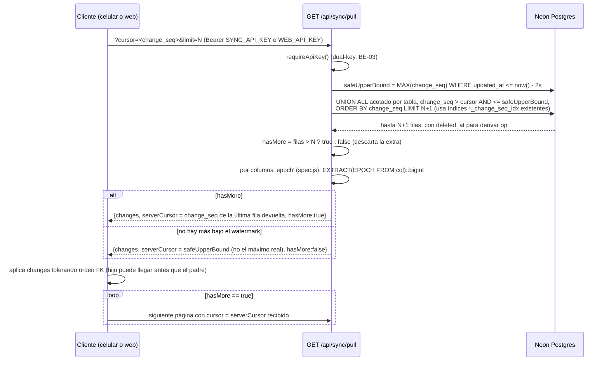
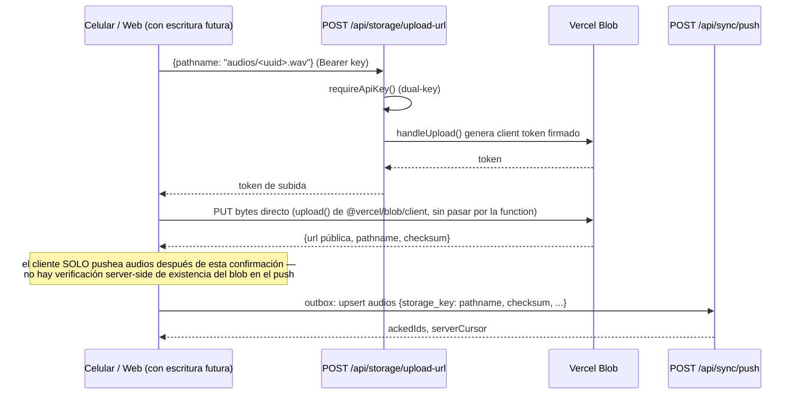

# Architecture Research — milestone v1.0 (workstream `web`)

**Domain:** integración de un endpoint de pull cross-tabla + web de solo lectura + storage de audio, sobre un backend Vercel Functions + Neon ya existente.
**Researched:** 2026-09-23
**Confidence:** MEDIA — el diseño de la query de pull y del ruteo Vercel monorepo está argumentado desde el código real y docs oficiales, pero dos puntos (config exacta de `vercel.json` para "mismo proyecto" y necesidad real de un endpoint de download-url) quedan marcados como spike de Fase 10/12, no verificados en un deploy real.

## Hallazgo previo, transversal a todo lo demás

**Colisión de nombres: `web/` ya existe en este repo y NO es la web de gestión.** `web/` en la raíz (`web/index.html:1-20`, `web/manifest.json`, `web/icons/`) es el target de plataforma web que `flutter create` generó por default — contiene el placeholder `<base href="$FLUTTER_BASE_HREF">` típico de Flutter, no HTML de una SPA propia. No se usa: `pubspec.yaml` no tiene sección `flutter: platforms:` restringiendo a él, no hay ningún workflow en `.github/workflows` que corra `flutter build web`, y las Constraints del proyecto (`PROJECT.md:68`) fijan Android/iOS como únicas plataformas. Es scaffold muerto.

ADR-005 dice "app, `backend/` y `web/` en este repo" — pero ese `web/` no puede ser literalmente la carpeta nueva sin pisar el scaffold de Flutter (y sin romper `flutter build` si alguna vez se habilita la plataforma web de la app). **Decisión a tomar en Fase 10, no asumida acá:** o (a) la web de gestión vive en otra carpeta (`admin/` o `webapp/`) y ADR-005 se corrige/aclara, o (b) se borra el scaffold Flutter muerto y se reutiliza literalmente `web/` para la SPA de gestión. Este documento asume (a) por ser el cambio más chico (no toca nada de Flutter) y usa `admin/` como nombre de trabajo en los ejemplos de abajo — ajustar si el usuario prefiere (b).

## 1. Pull — diseño de la query

### `change_seq` es una única secuencia global (confirmado en schema)

`backend/schema.sql:6` — `CREATE SEQUENCE IF NOT EXISTS change_seq;` — una sola secuencia de Postgres compartida por las 7 tablas. Cada tabla tiene su propia columna `change_seq bigint DEFAULT nextval('change_seq')` (`schema.sql:16,30,41,60,74,89,105`) y un trigger `bump_change_seq()` (`schema.sql:129-134,146-156`) que la reasigna en cada INSERT/UPDATE (incluida la fila que ya existía — un update mueve su `change_seq` al final de la secuencia global). Esto confirma lo que dice `.planning/ARCHITECTURE.md:141`: "orden de cambios... secuencia global, la usa el cursor de pull". No hay una columna `op`; hay que derivarla de `deleted_at IS NOT NULL` (ya es así en el modelo — `deleted_at` es soft-delete, ver `backend/api/_lib/outbox.js:47-53`).

### Riesgo real: gap por commit fuera de orden de `nextval()`

`nextval('change_seq')` se ejecuta en el trigger **BEFORE INSERT/UPDATE** (`schema.sql:151`), es decir, antes del commit de la transacción. Dos transacciones concurrentes pueden pedir secuencia en un orden y commitear en el orden inverso:

```
Tx A: nextval() -> 100                Tx B: nextval() -> 101
                                       Tx B: COMMIT (rápido)
Tx A: COMMIT (más lento)
```

Un lector que hace `pull` entre el commit de B y el de A ve `change_seq=101` pero no `100` (A todavía no comiteó). Si el cliente avanza su cursor a `101` (porque es el máximo visto), la fila `100` de A, cuando por fin comitea, queda con `change_seq=100 <= cursor` y el filtro `WHERE change_seq > $cursor` la salta **para siempre** — no es un delay, es una pérdida de cambio.

**Evaluación para v0 (un solo editor):** hoy el único escritor real es `POST /sync/push`, y cada push corre en **una sola transacción** (`backend/api/sync/push.js:40` — `sql.transaction(outbox.map(...))`), así que todas las filas de un mismo push comitean atómicas juntas; el problema solo aparece si **dos requests de push distintos se solapan** (reintento del celular mientras el original sigue en vuelo — exactamente el caso "kill-mid-push" que `PROJECT.md:22` ya identifica como diferido a QA manual). La web de este milestone es de solo lectura (ADR-004, `PROJECT.md:124`), así que no agrega un segundo escritor. Probabilidad real hoy: baja, pero no cero — Vercel puede invocar dos ejecuciones concurrentes de la misma function por un timeout+retry del cliente.

**Mitigación recomendada (barata, no over-engineering):** un watermark de seguridad basado en tiempo, no en secuencia. La query de pull no debe devolver ni avanzar el cursor más allá de filas que ya "asentaron" un margen corto:
> ⚠ Reemplazado por ADR-012 / phases/10-pull-cerrado-auth-dual-key/10-CONTEXT.md D-01 (advisory lock de Postgres): el margen sobre updated_at no protege porque esa columna la pone el cliente.

```sql
-- p.ej. 2s: una transacción de push (batch chico, un solo INSERT/UPDATE por fila) comitea
-- en decenas o cientos de ms en Neon; 2s da margen de sobra sin notarse en el celular ni la web.
safeUpperBound := (SELECT COALESCE(MAX(change_seq), 0) FROM <cada tabla>
                    WHERE updated_at <= now() - interval '2 seconds')
```

y el handler solo pagina dentro de `change_seq <= safeUpperBound`. Si `hasMore=false` porque se agotó lo disponible bajo `safeUpperBound` (pero existen filas más nuevas que `safeUpperBound`, todavía "en cuarentena"), el `serverCursor` devuelto se cappea a `safeUpperBound`, **no** al máximo global real — así una fila tardía con `change_seq` menor que ya haya sido "adelantada" por otra más nueva pero fuera de cuarentena nunca queda del otro lado del cursor. Es una columna de cálculo extra (`MIN` de dos valores) sobre una query que ya se necesita — no una segunda tabla ni un lock. `ponytail:` aceptar el riesgo residual (ventana de 2s asume que ninguna transacción de push tarda más que eso; si algún día se prueba lo contrario, subir el número es un cambio de una constante, no de arquitectura) en vez de construir snapshot/2PC real, justificado por ser v0 de un solo editor.

**Alternativa descartada:** aceptar el riesgo sin ninguna mitigación ("v0, un editor, probabilidad muy baja"). Se descarta como *primera* opción porque el costo de la mitigación es una cláusula `WHERE` y un `MIN()`, no una reescritura — más barato que documentar y re-explicar el riesgo cada vez que alguien audite el pull. Si en la práctica el ADR de fase 10 decide que ni eso vale la pena, es una decisión legítima de bajar la escalera un peldaño más — pero el research recomienda tomar esta.

### Query recomendada: UNION ALL acotado, no un UNION global sin cotas

Índices ya existen: `schema.sql:118-124` (`<tabla>_change_seq_idx` en las 7 tablas) — **no hace falta crear ningún índice nuevo para BE-01**, ya estaban preparados.

Patrón (probadamente correcto y usa los índices existentes en vez de forzar un sort del universo completo):

```sql
SELECT * FROM (
  (SELECT 'recorridos' t, uuid, change_seq, deleted_at, updated_at, ... FROM recorridos
     WHERE change_seq > $cursor AND change_seq <= $safeUpperBound
     ORDER BY change_seq LIMIT $limit)
  UNION ALL
  (SELECT 'audios' t, ... FROM audios WHERE change_seq > $cursor AND change_seq <= $safeUpperBound
     ORDER BY change_seq LIMIT $limit)
  UNION ALL  -- ... una subselect igual por cada una de las 7 tablas
) s
ORDER BY change_seq LIMIT $limit;
```

Por qué es correcto: cada subselect trae, ordenados, sus primeros `$limit` candidatos con `change_seq > cursor`. El verdadero top-`$limit` global tiene que estar contenido en la unión de los top-`$limit` de cada tabla (si una fila de la tabla T está entre las `$limit` más chicas globales, por definición está entre las `$limit` más chicas *de T*). El `ORDER BY ... LIMIT` externo arma el resultado final correcto sin necesitar escanear las tablas completas. Cada subselect usa el índice `<tabla>_change_seq_idx` para un index scan acotado.

`hasMore`: pedir `$limit + 1` en la query externa; si vuelven más de `$limit` filas, `hasMore=true` y se descarta la fila extra antes de responder.

### Serialización simétrica con push

`push.js`/`outbox.js` convierten epoch→timestamptz al escribir (`to_timestamp($n)`, `outbox.js:59`). El pull necesita la conversión inversa, columna por columna, reusando `TABLE_SPEC` (`backend/api/_lib/spec.js:3,7-49`) que ya marca qué columnas son `'epoch'` (`logical_version`, `updated_at`, `deleted_at`). Para cada columna `epoch`: `EXTRACT(EPOCH FROM col)::bigint AS col`. Esto es la única transformación necesaria — el resto de columnas (`text`, `int`, `float`, `uuid`) salen tal cual, igual que en push.

`op` por fila: `deleted_at IS NOT NULL` → `'delete'`; si no, `'upsert'` — no es una columna, se calcula en el handler antes de armar el JSON de respuesta.

## 2. ¿Pagina la web o hace snapshot completo?

**No hace falta un modo especial para la web.** El endpoint ya es correcto y suficientemente simple para ambos consumidores si el límite por página es generoso (p.ej. `limit=1000`, tope duro server-side en, digamos, `2000`, evitando que un cliente pida un `limit` absurdo). Con ~77 audios + unos cientos de triggers + el resto de tablas, el total de filas sincronizables hoy es del orden de mil — cabe en una sola página con ese límite, casi siempre.

Recomendación concreta para la web (`admin/src/...`): implementar el loop genérico igual que tendría que hacerlo el celular — `cursor=0`, pedir, acumular `changes` en memoria, si `hasMore` seguir con `serverCursor` como próximo cursor, hasta `hasMore=false`. Son ~10 líneas de loop, no una segunda ruta ni un flag `?full=true`. Esto es preferible a "asumir que siempre entra en una página" porque el dato crece (más obras, más recorridos) y la web no debe romperse el día que supere el límite — y evita construir un endpoint de snapshot aparte que duplicaría la lógica del BE-01 que el celular ya necesita.

## 3. Dónde vive el código web, ruteo Vercel, y la API key

### Ubicación de código

- **Nueva carpeta** `admin/` (o el nombre que se resuelva por la colisión de la sección "Hallazgo previo") — Vite + React + Leaflet, proyecto independiente con su propio `package.json`, no anidado dentro de `backend/`.
- `backend/` sigue siendo dueño exclusivo de `api/`, `schema.sql`, `scripts/` — sin cambios de ubicación.

### Ruteo — "mismo proyecto Vercel" (`PROJECT.md:120`)

Hoy `backend/vercel.json:1-5` es el `vercel.json` de un proyecto Vercel cuyo *Root Directory* está configurado como `backend/` (deploy independiente, confirmado por el rewrite relativo `/sync/:path*` → `/api/sync/:path*`, que solo tiene sentido si `api/` cuelga de la raíz de *ese* proyecto). Para que la web y el backend convivan en el mismo proyecto Vercel hace falta mover el *Root Directory* del proyecto a la raíz del repo y un `vercel.json` en la raíz del repo (nuevo archivo, no reemplaza a `backend/vercel.json` que puede quedar o borrarse):

```json
{
  "functions": { "backend/api/**/*.js": {} },
  "rewrites": [
    { "source": "/sync/:path*", "destination": "/backend/api/sync/:path*" },
    { "source": "/storage/:path*", "destination": "/backend/api/storage/:path*" }
  ],
  "buildCommand": "cd admin && npm install && npm run build",
  "outputDirectory": "admin/dist"
}
```

**Confianza MEDIA-BAJA en el `functions` glob apuntando fuera del `api/` de raíz** — la búsqueda contra docs oficiales de Vercel confirma el mecanismo de `functions` + `rewrites` en `vercel.json` para monorepos, pero no hay una verificación directa contra un deploy real de que Vercel sirva funciones cuyo path físico no es `api/` en la raíz del proyecto sin el flag `functions` explícito arriba. **Tratar esto como un spike de 30-60 min al arrancar la Fase 10 de ruteo (Fase 12 en el build order de abajo), no como un hecho asumido** — si el glob no funciona como se espera, la alternativa de bajo esfuerzo es físicamente mover `backend/api/` → `api/` en la raíz (dejar `backend/` solo con `schema.sql`/`scripts/`/tests) y usar la convención default de Vercel sin `functions` custom.

El rewrite de SPA (todo lo que no matchea `/sync/*` ni `/storage/*` cae al `index.html` de la SPA) lo agrega automáticamente el framework preset de Vite/React de Vercel si se detecta `admin/` como el proyecto de framework — si no, agregar `{ "source": "/((?!sync|storage).*)", "destination": "/index.html" }` explícito.

### `WEB_API_KEY` en el cliente

Un solo usuario admin, sin necesidad de sesiones multi-usuario ni logout entre personas distintas. Recomendación: **`sessionStorage`**, no `localStorage`. Trade-off relevante: `sessionStorage` se pierde al cerrar la pestaña/navegador — para un solo editor que abre la web esporádicamente para revisar estado, volver a tipear la key ocasionalmente es aceptable y evita dejar la key viva indefinidamente en el disco si el usuario comparte la compu o usa un navegador compartido de instalación de arte. `localStorage` sería más cómodo (persiste) pero no hay ningún requisito que pida esa comodidad, y el downside de seguridad (persistencia indefinida de un Bearer token en disco, sin expiración) pesa más para una app que en el futuro (v1, multi-usuario) puede tener credenciales más sensibles — no vale la pena acostumbrar el patrón ahora. `ponytail:` sessionStorage + un input de key en una pantalla de acceso simple; sin flujo de login real, sin refresh tokens — agregar eso si/cuando haya usuarios reales distintos del artista.

## 4. Storage de audio (BE-04)

### Proveedor

**Vercel Blob** — ya fue identificado como candidato en `PROJECT.md:83` ("Neon no guarda blobs"). Encaja mejor que evaluar alternativas nuevas: mismo proveedor de deploy (Vercel), free tier acorde a "bajo costo" (constraint de `PROJECT.md:66`), y sobre todo tiene un flujo de **client upload autorizado por el servidor** ya construido específicamente para el caso "el backend no debe recibir los bytes" (`handleUpload` + `generateClientTokenFromReadWriteToken`, de `@vercel/blob/client`, confirmado en docs oficiales de Vercel). Esto es exactamente lo que pide BE-04 ("cliente→storage directo, backend emite autorización de subida"), sin escribir ningún proxy de bytes.

### Endpoints nuevos

- **`POST /api/storage/upload-url`** (nuevo archivo `backend/api/storage/upload-url.js`) — recibe `{pathname}` (p.ej. `audios/<uuid>.wav`), valida `requireApiKey` (ver abajo, dual-key), delega en `handleUpload` de `@vercel/blob/client` para devolver el token de subida firmado. El celular (Fase 2.2 del workstream `app`) y, más adelante, la web (cuando tenga escritura) lo llaman antes de subir bytes.
- **`GET /storage/download-url` — no se agrega.** Vercel Blob devuelve una URL pública estable en el momento de la subida (`https://<store-id>.public.blob.vercel-storage.com/<pathname>`); guardando el `pathname` en `audios.storage_key` (ya es el campo que existe, `schema.sql:25-26`), la web arma la URL completa con una constante de build (`VITE_BLOB_BASE_URL`) sin ida y vuelta al backend. `ponytail:` si más adelante el audio necesita dejar de ser público (moderación, contenido no listado), ahí se agrega un endpoint de URL firmada de lectura — hoy sería una abstracción sin necesidad real, el ERS no pide privacidad de audio en v0/v1.0.

### Auth dual-key (BE-03)

`backend/api/_lib/auth.js:11-21` hoy compara contra una sola variable `SYNC_API_KEY`. Modificación necesaria (archivo existente, **modificado**, no nuevo): aceptar `SYNC_API_KEY` o `WEB_API_KEY` como válidas —

```js
export function requireApiKey(request) {
  const candidates = [process.env.SYNC_API_KEY, process.env.WEB_API_KEY].filter(Boolean);
  if (candidates.length === 0) return AUTH_ERROR;
  const provided = /* igual que hoy */;
  const providedBuf = Buffer.from(provided);
  const ok = candidates.some((k) => {
    const kBuf = Buffer.from(k);
    return providedBuf.length === kBuf.length && timingSafeEqual(providedBuf, kBuf);
  });
  return ok ? null : AUTH_ERROR;
}
```

Mantiene la garantía "config faltante = cerrado" (si ninguna de las dos está seteada, sigue rechazando) y el `timingSafeEqual` por candidato (no hay atajo de comparar contra un string concatenado, cada key debe compararse con largo igual). Esto habilita tanto `pull` como `push`/`state`/`storage/upload-url` para que la web use `WEB_API_KEY` sin heredar permisos de escritura reales — la separación de *qué puede hacer* cada key (p.ej. si la web no debería poder pushear en este milestone) no está impuesta por `auth.js` sino por qué endpoints expone el frontend; dado que la web de este milestone es de solo lectura, no hay riesgo nuevo aunque técnicamente `WEB_API_KEY` sea aceptada también en `/sync/push` — vale la pena anotarlo como deuda consciente para cuando la web escriba (ADR-006 etapa 1/2): en ese momento sí puede convenir diferenciar permisos por key, no antes.

### Consistencia audios-row ↔ objeto en storage

No hay ningún mecanismo transaccional que ate el objeto subido a Blob con la fila `audios` — son dos sistemas distintos sin 2PC. Estados posibles y su impacto real:

| Estado | Causa | Impacto | Mitigación |
|---|---|---|---|
| Objeto subido, push nunca llega | cliente corta conexión entre subir bytes y pushear la fila `audios` | objeto huérfano en Blob, sin costo funcional (nadie referencia esa key), solo costo de storage residual | ninguna en v1.0 — job de limpieza de huérfanos es trabajo futuro si el volumen lo justifica (no hoy, ~77 audios) |
| Fila `audios` con `storage_key` seteado, pero el objeto nunca se subió o se borró en Blob | orden incorrecto en el cliente (pushea antes de confirmar upload), o borrado manual en el dashboard de Vercel | reproducción falla (404) en celular y web | el cliente (celular/web, fuera de este backend) debe pushear la fila `audios` **solo después** de recibir confirmación de subida exitosa desde `@vercel/blob/client`'s `upload()`; el backend no verifica existencia del blob al aceptar el push (ver próximo punto) |

`ponytail:` no agregar una verificación server-side (`HEAD` a Blob) en el momento del push solo para este caso — es una llamada de red extra en el hot path de push por cada fila `audios`, para un caso de error que ya se previene por orden correcto del lado cliente, y que además de fallar es visible inmediatamente (audio no reproduce) en vez de silencioso. Si en producción aparece este caso con frecuencia, ahí se agrega el chequeo — la ceiling actual es "consistencia eventual manual, ordenada por el cliente".

## 5. Diagramas de secuencia

### 5.1 Pull (celular o web, mismo endpoint — ADR-004)



### 5.2 Subida de audio (client upload autorizado — BE-04)



## 6. Build order sugerido — a partir de Fase 10

| Fase | Contenido | Depende de | Desbloquea |
|---|---|---|---|
| **10** | BE-01 `GET /sync/pull` (query UNION acotada + watermark de 2s, serialización epoch simétrica con push) + BE-05 (agregar `recorridos` a `state.js:4-11`) | nada nuevo (usa schema/spec existentes) | **Fase 3 del workstream `app`** (pull en el celular) — el contrato queda cerrado acá, `app` no programa contra el endpoint hasta que esta fase termine (`PROJECT.md:109`) |
| **11** | BE-03: `auth.js` dual-key (`SYNC_API_KEY` / `WEB_API_KEY`) | ninguna | Fase 12, Fase 14 (cualquier endpoint que la web deba llamar) |
| **12** | Infra de ruteo: resolver colisión de nombre `web/` (ver sección "Hallazgo previo"), `vercel.json` de raíz, spike de `functions` glob, verificar que Preview no usa `DATABASE_URL` de Production (ADR-005) | ninguna (puede ir en paralelo con 10/11) | Fase 13 (necesita poder deployar algo servible antes de construir la SPA sobre ella) |
| **13** | Web de gestión (Vite+React+Leaflet): pantalla de acceso (`WEB_API_KEY` en `sessionStorage`), loop de pull completo en memoria, mapa general (bbox/paths/triggers), listados y detalle de recorridos/obras/artistas/paths/audios, estado de sync | 10, 11, 12 | — |
| **14** | BE-04 storage: ADR de proveedor (Vercel Blob), `POST /api/storage/upload-url`, `VITE_BLOB_BASE_URL` en la web para reproducir audio ya subido | 11 (dual-key) | **2.2 del workstream `app`** (subida desde el celular) y reproducción de audio en la web de este milestone |

Fases 10 y 11 pueden ejecutarse en paralelo entre sí (no comparten archivos); 12 puede arrancar en paralelo con ambas ya que es infraestructura de deploy, no de negocio. 13 y 14 son las únicas con dependencia dura hacia atrás. La numeración es continua sobre la que ya usa el workstream `web` (arranca en 10 per `PROJECT.md:111`).

## Sources

- Código real leído directamente: `backend/schema.sql`, `backend/api/sync/push.js`, `backend/api/sync/state.js`, `backend/api/_lib/auth.js`, `backend/api/_lib/db.js`, `backend/api/_lib/spec.js`, `backend/api/_lib/outbox.js`, `backend/vercel.json`, `backend/README.md`, `lib/data/sync/sync_api.dart`, `.planning/PROJECT.md`, `.planning/ARCHITECTURE.md` — confianza ALTA (fuente primaria).
- [Static Configuration with vercel.json](https://vercel.com/docs/project-configuration/vercel-json) — confirma `functions`/`rewrites`/`buildCommand`/`outputDirectory` — confianza MEDIA (no verificado contra deploy real de este repo).
- [Using Monorepos — Vercel](https://vercel.com/docs/monorepos) y [Monorepos FAQ](https://vercel.com/docs/monorepos/monorepo-faq) — confianza MEDIA.
- [Client Uploads with Vercel Blob](https://vercel.com/docs/vercel-blob/client-upload) — confirma `handleUpload` + `generateClientTokenFromReadWriteToken` de `@vercel/blob/client` para subida directa cliente→storage — confianza MEDIA-ALTA (docs oficiales, no probado en este proyecto).
- [@vercel/blob — using the SDK](https://vercel.com/docs/vercel-blob/using-blob-sdk) — confianza MEDIA.

---
*Architecture research para: milestone v1.0, workstream `web`, Cíngula App*
*Researched: 2026-09-23*


> **Reemplazado (2026-09-23):** este margen sobre `updated_at` es inválido — esa columna la pone el cliente, no el servidor, así que no protege contra el commit tardío que describe. El mecanismo real se decidió en `phases/10-pull-cerrado-auth-dual-key/10-CONTEXT.md` D-01 (advisory lock de Postgres) y en ADR-012 en Notion.